# **1. Парадигмы программирования. Введение в объектно-ориентированные концепции.**
**Парадигмы программирования** — это подходы к написанию кода, определяющие структуру и стиль разработки. Вот ключевые из них:
* **Императивное программирование:** программа как последовательность команд, изменяющих состояние (переменные, циклы, условные операторы).
* **Декларативное программирование:** описание что нужно сделать, а не как.
* **Процедурное программирование:** разделение кода на процедуры/функции
* **Объектно-ориентирование программирование**
---
**Объектно-ориентированное программирование** – это парадигма программирования, способ организации программы, позволяющий использовать один и тот же код многократно. В отличие от функций и модулей, ООП позволяет не только разделить программу на фрагменты, но и описать предметы реального мира в виде удобных сущностей — объектов, а также организовать связи между этими объектами.
## **Основные концепции ООП:**
### **1. Наследование.**
Основное (но не единственное) преимущество, которое дает концепция наследования в программировании, – это вынос одинакового кода из разных классов в один родительский класс. Другими словами, наследование позволяет сводить на нет повторение кода в разных частях программы.
```PY
class Animal:
    def speak(self):
        pass

class Cat(Animal):  # Cat наследует Animal
    def speak(self):
        print("Мяу!")
```

### **2. Инкапсуляция.**
Сокрытие внутренней реализации, предоставление только необходимых методов. Во многих языках этот термин обозначает сокрытие данных, то есть невозможность напрямую получить доступ к внутренней структуре объекта, так как это небезопасно. Например, наполнить желудок едой можно напрямую, положив еду в желудок. Но это опасно. Поэтому прямой доступ к желудку закрыт. Чтобы наполнить его едой, надо совершить ритуал, через элемент интерфейса под названием рот.
```PY
class BankAccount:
    def __init__(self):
        self.__balance = 0  # Приватный атрибут

    def deposit(self, amount):
        self.__balance += amount

    def get_balance(self):
        return self.__balance
```
### **3. Полиморфизм.**
Это возможность использовать объекты разных классов через общий интерфейс. Можно перевести как множество форм. В ООП под полиморфизмом понимается следующее. Объекты разных классов, с разной внутренней реализацией, то есть программным кодом, могут иметь "одинаковые" методы. На самом деле у методов совпадают только имена, а вложенный в них код (то, что они делают) различен. Вот и получается, что у одного имени как бы множество форм.
```PY
def make_sound(animal):
    animal.speak()

dog = Dog()
cat = Cat()
make_sound(dog)  # "Гав!"
make_sound(cat)  # "Мяу!"
```


# **2. Фундаментальные концепции. Объекты и унаследованные системы**
Объектно-ориентированные языки определяются следующими концепциями: инкапсуляцией, наследованием и полиморфизмом. (вопрос 1)
Объектно-ориентированное программирование (ООП) и структурное программирование не конкурируют, а дополняют друг друга: объекты могут интегрироваться в структурированный код, расширяя его функциональность. Унаследованные системы, построенные на процедурном подходе, часто остаются эффективными, и их необязательно переписывать, если они справляются со своими задачами. Новые разработки, особенно веб и мобильные приложения, чаще используют ООП, но могут взаимодействовать со старыми системами через объектные оболочки — специальные объектно-ориентированные слои, которые инкапсулируют унаследованный код, делая его совместимым с современными технологиями. Например, мейнфреймы с устаревшим кодом могут подключаться к мобильным приложениям через такие оболочки, которые скрывают сложность старых систем. Это позволяет использовать преимущества ООП, такие как модульность и повторное использование кода, без риска, связанного с полной заменой работающих решений. Интеграция унаследованных систем с объектно-ориентированными подходами стала особенно актуальной с развитием веб- и мобильных технологий, где объекты естественным образом управляют данными и взаимодействием. Таким образом, объектные оболочки служат связующим звеном между старыми и новыми парадигмами, обеспечивая гибкость и снижая затраты на модернизацию.

# **3. Процедурное программирование в сравнении с объектно-ориентированным**
Процедурное программирование разделяет данные и функции: данные хранятся глобально или в структурах, а логика обрабатывается отдельными процедурами. Это упрощает понимание простых задач, но приводит к хаотичному доступу к данным, сложной отладке и низкой защищённости. Объектно-ориентированное программирование (ООП) объединяет данные (атрибуты) и поведение (методы) в объекты, инкапсулируя их. Это позволяет контролировать доступ к данным, скрывая внутреннюю реализацию, и упрощает взаимодействие через чёткие интерфейсы. Объекты действуют как «чёрные ящики»: внешний код не зависит от их внутренней логики, что повышает гибкость и удобство модификации. ООП не заменяет процедурный подход, а дополняет его, особенно в сложных системах, где важны структурированность и повторное использование кода. Однако его эффективность зависит от правильного проектирования — без этого даже ООП может привести к неудобному коду.

# **4. Переход с процедурной разработки на объектно-ориентированную**
Процедурное программирование разделяет данные и функции (код), что упрощает решение простых задач, но усложняет управление сложными системами из-за хаотичного доступа к данным и сложной отладки. Объектно-ориентированное программирование (ООП) объединяет данные (атрибуты) и поведение (методы) в объекты, инкапсулируя их. Это позволяет скрывать внутреннюю реализацию, контролировать доступ к данным и упрощает модификацию системы.
Для интеграции унаследованных процедурных систем в ООП используются объектные оболочки — специальные классы, которые «упаковывают» старый код, предоставляя объектный интерфейс. Это позволяет постепенно внедрять ООП, не переписывая рабочие системы.
## **Преимущества ООП:**
* **Модульность:** изменения в одном объекте не влияют на остальной код.
* **Повторное использование:** объекты с универсальным поведением (например, классы для работы с сетью) можно применять в разных частях системы.
* **Управление сложностью:** инкапсуляция и чёткие интерфейсы упрощают разработку и поддержку.
## **Пример** 
Передача объекта по сети включает в себя не только данные, но и методы для их обработки, что гарантирует целостность и предсказуемость взаимодействия. ООП не заменяет процедурный подход, а дополняет его, особенно в проектах, где важны масштабируемость и долгосрочная поддержка.
Примеры:
### **Процедурный стиль**
```PY
balance = 0  # Глобальная переменная

def deposit(amount):
    global balance
    balance += amount

def withdraw(amount):
    global balance
    if amount <= balance:
        balance -= amount
    else:
        print("Недостаточно средств")

def get_balance():
    return balance

# Использование
deposit(100)
withdraw(50)
print(get_balance())  # Вывод: 50
```


### **Объектно-ориентированный стиль**
```PY
class BankAccount:
    def __init__(self):
        self.__balance = 0  # Приватное поле

    def deposit(self, amount):
        self.__balance += amount

    def withdraw(self, amount):
        if amount <= self.__balance:
            self.__balance -= amount
        else:
            print("Недостаточно средств")

    def get_balance(self):
        return self.__balance

# Использование
account = BankAccount()
account.deposit(100)
account.withdraw(50)
print(account.get_balance())  # Вывод: 50
```

## Преимущества ООП:
* Данные (__balance) защищены от прямого доступа (инкапсуляция).
* Легко создавать множество независимых объектов (account1 = BankAccount(), account2 = BankAccount()).

# **5. Что такое объект? Данные объектов. Поведение объектов**
В ООП **объект** — это экземпляр класса, который объединяет данные (поля) и поведение (методы). Объекты могут представлять реальные или абстрактные сущности. 
Если мы возьмем конкретный стол, то это объект, но не класс. А вот общее представление о столах, их назначении – это класс. Ему принадлежат все реальные объекты столов, какими бы они ни были. Класс столов дает общую характеристику всем столам в мире, он их обобщает. объекты класса принято называть также экземплярами.
**Данные объектов** – переменные, описывающие характеристики объекта. Данные, содержащиеся в объекте, представляют его состояние. В терминологии ООП эти данные называются **атрибутами**. Данные хранятся в полях объекта и могут быть скрытыми (конфиденциальными) для защиты от внешнего доступа.
**Поведение объекта** представляет то, что он может сделать. В процедурных языках поведение определяется процедурами, функциями и подпрограммами. 
В терминологии объектно-ориентированного программирования поведения объектов содержатся в методах. Если переменные хранят некоторые значения, то методы содержат собой набор инструкций, которые выполняют определенные действия. По сути метод - это именованный блок кода, который выполняет некоторые действия.
 
## Пример объекта:
```PY
class Car:
    def __init__(self, brand, color, max_speed):
        # Данные объекта (состояние)
        self.brand = brand       # Марка машины
        self.color = color       # Цвет
        self.max_speed = max_speed  # Максимальная скорость
        self.__current_speed = 0  # Приватное поле (инкапсуляция)

    # Поведение объекта (методы)
    def accelerate(self, increment):
        if self.__current_speed + increment <= self.max_speed:
            self.__current_speed += increment
            print(f"Ускоряемся до {self.__current_speed} км/ч")
        else:
            print("Достигнута максимальная скорость!")

    def brake(self):
        self.__current_speed = 0
        print("Машина остановилась")

    def get_speed(self):
        return self.__current_speed  # Контролируем доступ к приватному полю
```

Очень важно понимать разницу между атрибутами объекта класса и атрибутами экземпляра класса. Атрибут объекта класса существует в единственном экземпляре, доступен всем экземплярам класса, его изменение можно видеть во всех экземплярах класса. Атрибут экземпляра класса хранит уникальное значение для каждого экземпляра, и изменение его в одном экземпляре класса не затронет значения одноименного атрибута в других экземплярах того же класса.

# **6. Что такое класс? Создание объектов. Атрибуты. Методы. Сообщения**
**Класс** — сложный тип данных, включающий набор переменных и функций для управления значениями, хранящимися в этих переменных.
Переменные называют атрибутами или свойствами, а функции — методами. Класс является фабрикой объектов, т. е. позволяет создать неограниченное количество экземпляров, основанных на этом классе.
Однако в случае классов используется особая терминология. Имена, определенные в классе, называются атрибутами этого класса. В примере имена n и adder – это атрибуты класса B. Атрибуты-переменные называют полями или свойствами (в других языках понятия "поле" и "свойство" не совсем одно и то же). Полем является n. Атрибуты-функции называются методами. Методом в классе B является adder. Количество свойств и методов в классе может быть любым.
Если переменные хранят некоторые значения, то методы содержат собой набор инструкций, которые выполняют определенные действия. По сути метод - это именованный блок кода, который выполняет некоторые действия.
**Сообщения** — это механизм коммуникаций между объектами. Например, когда объект А вызывает метод объекта В, объект А отправляет сообщение объекту В. Ответ объекта В определяется его возвращаемым значением. Только открытые, а не закрытые методы объекта могут вызываться другим объектом. Приведенный далее код демонстрирует эту концепцию:
```java
public class Payroll{
    String name;
    Person p = new Person();
    p.setName("Joe");
    ...код
    name = p.getName();
}
```

**Событие** - возникновение определенной ситуации при работе программы. Событиями являются нажатие клавиши, перемещение мыши, истечение интервала времени. В объектах есть специальные методы - обработчики событий. Обработчик событий – обычная процедура, вызываемая на выполнение автоматически при наступлении этого события.
 

 
# **7. Использование диаграмм классов в качестве визуального средства**
 Диаграммы классов UML служат инструментом визуализации структуры программных систем, помогая проектировать и анализировать взаимодействие компонентов. Они отображают атрибуты (в верхней части) и методы (в нижней части) классов, что упрощает понимание их организации. Например, диаграмма класса Person демонстрирует разделение данных и поведения, что критично для объектно-ориентированного проектирования. По мере усложнения систем диаграммы расширяются, отражая связи между классами (наследование, ассоциации, зависимости), что позволяет наглядно представить архитектуру, выявить сложные взаимодействия и упростить коммуникацию между разработчиками. Это делает их незаменимыми для обучения, проектирования и документирования ООП-систем.
 

# **8. Инкапсуляция и сокрытие данных.**
Одно из основных преимуществ использования объектов заключается в том, что объекту не нужно показывать все свои атрибуты и поведения. При хорошем ООП (по крайней мере, при таком, которое повсеместно считается хорошим) объект должен показывать только интерфейсы, необходимые другим объектам для взаимодействия с ним. Детали, не относящиеся к использованию объекта, должны быть скрыты от всех других объектов согласно принципу необходимого знания. Инкапсуляция определяется тем, что объекты содержат как атрибуты, так и поведения. Сокрытие данных является основной частью инкапсуляции. Например, объект, который применяется для вычисления квадратов чисел, должен обеспечивать интерфейс для получения результатов. Однако внутренние атрибуты и алгоритмы, используемые для вычисления квадратов чисел, не нужно делать доступными для запрашивающего объекта. Надежные классы проектируются с учетом инкапсуляции.
## **Пример инкапсуляции из вопроса 1:**
```PY
class BankAccount:
    def __init__(self):
        self.__balance = 0  # Приватный атрибут

    def deposit(self, amount):
        self.__balance += amount

    def get_balance(self):
        return self.__balance
```
# **9. Интерфейсы и реализации. Реальный пример парадигмы «интерфейс/реализация». Модель парадигмы «интерфейс/реализация»**
**Интерфейс** определяет способы взаимодействия с объектом, включая публичные методы, которые доступны извне. Любое поведение, которое обеспечивается объектом, должно вызываться через сообщение, отправляемое с использованием одного из предоставленных интерфейсов. В случае с интерфейсом должно предусматриваться полное описание того, как пользователи соответствующего класса будут взаимодействовать с этим классом. В большинстве объектно-ориентированных языков программирования методы, являющиеся частью интерфейсов, определяются как public.
В процедурном программировании интерфейсы отсутствуют — данные и функции разделены. В ООП данные инкапсулированы, а интерфейс гарантирует, что взаимодействие происходит через чётко определённые методы.
**Реализация** — это внутренняя логика объекта (закрытые атрибуты и методы). Например, алгоритм вычисления квадратного корня или проверка пин-кода в банкомате. Реализация может меняться (например, оптимизация алгоритма), но интерфейс остаётся неизменным, что гарантирует совместимость с существующим кодом.
## **Реальный пример парадигмы.**
Электростанция (реализация) вырабатывает электричество разными способами (уголь, газ, солнечные панели), но предоставляет единый интерфейс — стандартные параметры тока (220 В, 50 Гц). Потребители (дома, приборы) используют этот интерфейс, не зная, как работает станция внутри.
### **Суть:**
Интерфейс определяет правила взаимодействия («что делает система»), а реализация — внутренние механизмы («как это делается»). Даже если станция перейдёт с угля на атомную энергию (смена реализации), потребители продолжат пользоваться электричеством через тот же интерфейс.
## **Модель парадигмы «интерфейс/реализация».**
Класс **IntSquare** демонстрирует ключевой принцип разделения интерфейса и реализации. Пользователи этого класса взаимодействуют только с открытыми (public) методами, которые образуют интерфейс, в то время как внутренняя логика вычислений и данные скрыты в приватной (private) части.
В данном случае интерфейсом является метод **getSquare(int value)**, который принимает целое число и возвращает его квадрат. Пользователю не нужно знать, как именно происходит вычисление — он просто вызывает этот метод и получает результат. Внутренняя реализация, включая сам алгоритм расчёта квадрата, вынесена в приватный метод **calculateSquare(int value)**, а промежуточное значение хранится в приватном поле **squareValue**.
**Такой подход обеспечивает гибкость:** если разработчик захочет изменить способ вычисления квадрата (например, заменив умножение на вызов Math.pow(value, 2)), это не повлияет на пользователей класса, поскольку интерфейс останется прежним.
Сокрытие реализации снижает связность кода и уменьшает риск ошибок, так как внешние компоненты не зависят от внутренней структуры класса. Это особенно важно при работе с данными: например, если в будущем потребуется перенести вычисления в отдельный сервис или оптимизировать алгоритм, изменения затронут только закрытую часть класса, а его публичный API останется неизменным.
### **Пример IntSquare:**
```cs
public class IntSquare {
    private int squareValue;  // закрытый атрибут
    
    // Открытый интерфейс
    public int getSquare(int value) {
        squareValue = calculateSquare(value);
        return squareValue;
    }
    
    // Закрытая реализация
    private int calculateSquare(int value) {
        return value * value;  // или Math.pow(value, 2)
    }
}
```

# **10. Наследование. Суперклассы и подклассы. Абстрагирование. Отношения «является экземпляром».**
Наследование позволяет классу перенимать атрибуты и методы другого класса. Это дает возможность создавать новые классы абстрагированием из общих атрибутов и поведений других классов. Одна из основных задач проектирования при объектно-ориентированном программировании заключается в выделении общности разнообразных классов. Допустим, у вас есть класс **Dog** и класс **Cat**, каждый из которых будет содержать атрибут **eyeColor**. При процедурной модели код как для Dog, так и для Cat включал бы этот атрибут. При объектно-ориентированном проектировании атрибут, связанный с цветом, можно перенести в класс с именем **Mammal** наряду со всеми прочими общими атрибутами и методами. В данном случае оба класса — Dog и Cat — будут наследовать от класса Mammal. Итак, оба класса наследуют от Mammal. Это означает, что в итоге класс Dog будет содержать следующие атрибуты:
* **eyeColor:** унаследован от Mammal
* **barkFrequency:** определен только для Dog
В том же духе объект Dog будет содержать следующие методы:
* **getEyeColor:** унаследован от Mammal
* **bark:** определен только для Dog
Создаваемый экземпляр объекта Dog или Cat будет содержать все, что есть в его 
собственном классе, а также все имеющееся в родительском классе.
---
**Суперкласс (родительский, базовый класс)** – это класс, содержащий общие атрибуты и методы для группы родственных объектов. Например, класс **Mammal** может включать свойства (eyeColor, hairColor) и методы (generateInternalHeat, growHair), общие для всех млекопитающих. Это устраняет дублирование кода и снижает риск ошибок.
**Подкласс (дочерний, производный класс)** – это класс, расширяющий суперкласс, наследуя его свойства и поведение, и добавляя уникальные особенности. Например, классы Dog и Cat наследуют общие черты от Mammal, но могут включать специфичные методы (bark() для Dog, meow() для Cat).
## **Преимущества наследования:**
* Исключает дублирование кода – общая логика хранится в суперклассе.
* Упрощает поддержку – изменения в суперклассе автоматически применяются ко всем подклассам.
* Позволяет расширять функциональность – подклассы добавляют уникальные атрибуты и методы без изменения родительского класса.
```cpp
class Mammal {  
    String eyeColor;  
    void growHair() { ... }  
}  

class Cat extends Mammal {  
    void meow() { ... }  // Уникальный метод  
}  
```
## Абстрагирование
**Абстрагирование** - это упрощение реальности путем выделения ключевых свойств объекта/класса и игнорирования несущественных деталей.

### **Как работает:**

В ООП абстрагирование реализуется через:

* Абстрактные классы (нельзя создать экземпляр, только унаследовать).

* Интерфейсы (описание "что может делать" без реализации).

### **Пример (Python):**

```PY
from abc import ABC, abstractmethod

class Animal(ABC):  # Абстрактный класс
    @abstractmethod
    def make_sound(self):  # Абстрактный метод (без реализации)
        pass

class Dog(Animal):
    def make_sound(self):  # Реализация обязательна
        print("Гав!")
```
### **Пример (C++):**

```cpp
class Animal {  // Абстрактный класс
public:
    virtual void makeSound() = 0;  // Чисто виртуальный метод
};

class Dog : public Animal {
public:
    void makeSound() override {  // Реализация
        std::cout << "Гав!";
    }
};
```

### **Зачем нужно:**

* Скрывает сложность.

* Определяет общий контракт для всех наследников.

## **Отношение "является экземпляром"**
Это связь между конкретным объектом и классом, описывающая принадлежность объекта к определенному типу.

### **Как работает:**

**Объект** — это экземпляр класса, созданный по его "шаблону".

В наследовании объект подкласса одновременно является экземпляром и своего класса, и всех его родителей.

### **Пример (Python):**

```PY
class Vehicle: pass
class Car(Vehicle): pass

my_car = Car()
print(isinstance(my_car, Car))     # True
print(isinstance(my_car, Vehicle)) # True (наследование)
```
### **Пример (C++):**

```cpp
class Vehicle {};
class Car : public Vehicle {};

Car myCar;
bool isCar = typeid(myCar) == typeid(Car);          // true
bool isVehicle = dynamic_cast<Vehicle*>(&myCar);    // true
```
### **Зачем нужно:**

Позволяет обрабатывать объекты разных подклассов единообразно через родительский класс.

# **11. Полиморфизм**
**Полиморфизм** — это фундаментальный принцип ООП, позволяющий объектам разных классов обрабатывать одинаковые сообщения (вызовы методов) специфичным для каждого класса образом. Суть полиморфизма заключается в способности объектов с одинаковым интерфейсом демонстрировать разное поведение.
## **Основные аспекты полиморфизма:**
### **1. Связь с наследованием.**
Полиморфизм чаще всего реализуется через наследование, когда подклассы переопределяют методы родительского класса. Например, класс **Shape** может содержать абстрактный метод **draw()**, который по-разному реализуется в классах **Circle**, **Square** и **Star**.
### **2. Абстрактные классы и методы**
Абстрактные классы (как Shape) определяют общий интерфейс, но не содержат конкретной реализации. Подклассы обязаны предоставить свою реализацию абстрактных методов (например, getArea() для расчета площади фигуры).
### **3. Пример работы полиморфизма**
Если создать массив объектов типа Shape, содержащий экземпляры Circle, Rectangle и Star, то вызов метода getArea() для каждого объекта приведет к выполнению соответствующей реализации:
* Для круга будет использована формула πr²
* Для прямоугольника — длина × ширина
* Для звезды — своя специфичная формула
### **4. Преимущества полиморфизма:**
* Единый интерфейс для работы с разными типами объектов
* Упрощение кода за счет устранения множественных проверок типов
* Возможность легкого расширения системы путем добавления новых классов
* Поддержка принципа "открытости/закрытости" (SOLID)

### **5. Полиморфизм без наследования**
Хотя классический полиморфизм реализуется через наследование, современные подходы допускают его реализацию через композицию и интерфейсы, что обеспечивает большую гибкость и избегает проблем глубоких иерархий наследования.
Полиморфизм позволяет создавать гибкие и расширяемые системы, где новые типы объектов могут быть добавлены без изменения существующего кода, работающего с абстрактными типами. Это особенно полезно в крупных проектах и при работе с коллекциями разнородных объектов, обрабатываемых единообразно.

# 12. **Композиция. Абстрагирование. Отношения «содержит как часть»**
Вполне естественно представлять себе, что одни объекты содержат другие объекты. У телевизора есть тюнер и экран. У компьютера есть видеокарта, клавиатура и жесткий диск. Хотя компьютер сам по себе можно считать объектом, его жесткий диск тоже считается полноценным объектом. Фактически вы могли бы открыть системный блок компьютера, достать жесткий диск и подержать его в руке. Как компьютер, так и его жесткий диск считаются объектами. Просто компьютер содержит другие объекты, например жесткий диск. Таким образом, объекты зачастую формируются или состоят из других объектов — это и есть **композиция**
---
**Абстрагирование** – это процесс выделения ключевых характеристик объекта, игнорируя несущественные детали. В ООП оно позволяет:
* Создавать иерархии классов (например, Mammal → Cat → PersianCat), где каждый уровень уточняет поведение.
* Избегать избыточности кода – общие свойства (например, eyeColor для Mammal) определяются в суперклассе.
* Упрощать проектирование – можно работать с высокоуровневыми концепциями (например, "птица"), не углубляясь в детали ("летает ли пингвин?").
### Проблемы абстрагирования:
* Слишком глубокая иерархия усложняет поддержку (например, Mammal → Dog → GermanShepherd).
* Жёсткие ограничения наследования (в Java/C# – только один родительский класс, в C++ – множественное наследование).
## Отношения «содержит как часть».
Хотя отношения наследования считаются отношениями **«является экземпляром»** по тем причинам, о которых мы уже говорили ранее, отношения композиции называются отношениями **«содержит как часть»**. Если взять пример из приводившегося ранее раздела, то телевизор содержит как часть тюнер, а так же экран. Телевизор, несомненно, не является тюнером, поэтому здесь нет ни каких отношений наследования. В том же духе частью компьютера является видеокарта, клавиатура и жесткий диск.
Фактически есть только два способа создания классов из других классов: наследование и композиция.
## Пример наследования:
```PY
class Animal:
    def speak(self):
        raise NotImplementedError

class Dog(Animal):
    def speak(self):
        return "Гав!"

class Cat(Animal):
    def speak(self):
        return "Мяу!"

dog = Dog()
print(dog.speak())  # Гав!
```
## Пример композиции:
```PY
class Engine:
    def start(self):
        return "Двигатель запущен"

class Car:
    def __init__(self):
        self.engine = Engine()  # Композиция
    
    def start(self):
        return self.engine.start()

car = Car()
print(car.start())  # Двигатель запущен
```

# 13. Разница между интерфейсом и реализацией. Интерфейс. Реализация. Пример интерфейса/реализации 
**Интерфейс** – это публичная "видимая" часть класса, с которой взаимодействуют пользователи (другие объекты или разработчики). Он определяет, что можно делать, но не как это реализовано.
**Реализация** – это внутренняя логика, скрытая за интерфейсом. Она отвечает за то, как именно работает функциональность.
## **1. Интерфейс**
Это "контракт" между классом и внешним миром.
### Примеры:
* Электрическая розетка (интерфейс для подключения приборов).
* Руль и педали в автомобиле (интерфейс для водителя).
* Публичные методы класса (например, getSquare() в IntSquare).
---
Изменения в интерфейсе могут нарушить работу существующего кода.
## **2. Реализация**
Это внутреннее устройство, скрытое от пользователя.
### Примеры:
* Как электростанция вырабатывает ток (розетке это неважно).
* Как работает двигатель автомобиля (водителю не нужно знать).
* Приватные методы и поля класса (например, calculateSquare()).
---
Изменения в реализации не должны влиять на пользователей, если интерфейс остаётся прежним.

## **Пример:**
**Интерфейс** – метод **toast()**, который знает пользователь.
**Реализация** – скрытый метод **_heat_coils()**, который выполняет работу.
```PY
class Toaster:
    # Интерфейс (публичный метод)
    def toast(self, duration):
        """Пользователь вызывает этот метод"""
        self._heat_coils(duration)  # Внутренняя реализация

    # Реализация (скрытый метод)
    def _heat_coils(self, duration):
        print(f"Нагрев спиралей {duration} сек... Хлеб готов!")
```

# **14. Использование абстрактного мышления при проектировании классов **
При проектировании классов в объектно-ориентированном программировании ключевым аспектом является использование **абстрактного мышления**, которое позволяет создавать гибкие и универсальные решения. Абстрактные интерфейсы фокусируются на том, что должно быть выполнено, а не на том, как именно это реализуется. Например, метод вроде **отвезтиВАэропорт()** задает цель, скрывая детали маршрута, такие как повороты или остановки. Это противопоставляется конкретным интерфейсам, которые описывают низкоуровневые действия (например, отдельные методы для поворотов), что делает их менее универсальными. Абстракция обеспечивает повторное использование классов, поскольку высокоуровневые интерфейсы остаются актуальными в разных контекстах. Например, интерфейс такси, реализующий метод отвезтиВАэропорт(), будет работать в любом городе, независимо от конкретного маршрута, в то время как управление каждым поворотом вручную ограничило бы применение класса. Кроме того, абстракция упрощает взаимодействие с клиентом, скрывая сложность реализации: пользователь не обязан знать, как именно таксист выберет маршрут, ему важен лишь результат. Это соответствует принципу минимального интерфейса, где методы решают задачи, а не управляют деталями. Однако абстракция не всегда означает полезность: конкретные классы могут быть эффективны в узких сценариях, но их сложно адаптировать для повторного использования. Таким образом, абстрактное мышление направлено на создание классов, которые легко модифицировать, повторно использовать и интегрировать в разные системы, фокусируясь на результатах, а не на способах их достижения.

```PY
from abc import ABC, abstractmethod

# Абстрактный класс (интерфейс)
class Taxi(ABC):
    @abstractmethod
    def drive_to_airport(self):
        pass  # Что делать, а не как

# Конкретные реализации для разных городов
class ChicagoTaxi(Taxi):
    def drive_to_airport(self):
        print("Едем по маршруту Чикаго: поворот налево, затем направо...")

class NewYorkTaxi(Taxi):
    def drive_to_airport(self):
        print("Едем по маршруту Нью-Йорка: через тоннель, затем на мост...")

# Клиентский код
def order_taxi(taxi: Taxi):
    taxi.drive_to_airport()  # Не знаем деталей, но уверены в результате

# Использование
chicago_taxi = ChicagoTaxi()
ny_taxi = NewYorkTaxi()

order_taxi(chicago_taxi)  # Вывод: Едем по маршруту Чикаго...
order_taxi(ny_taxi)       # Вывод: Едем по маршруту Нью-Йорка...
```

# **15. Обеспечение минимального интерфейса пользователя. Определение пользователей. Поведения объектов. Ограничения, налагаемые средой**
При проектировании класса следует **предоставлять только необходимые методы, скрывая внутреннюю реализацию**. Начинать нужно с минимального интерфейса, расширяя его по мере реальных потребностей пользователей, а не добавляя лишние функции заранее. Это снижает сложность, повышает безопасность (например, ограничивая доступ к конфиденциальным данным) и упрощает поддержку. Класс должен проектироваться с точки зрения удобства пользователя, а не технологических нюансов: важно взаимодействовать с будущими потребителями класса, а не только с разработчиками. Изначально интерфейсы создаются закрытыми, и только необходимые методы открываются позже, чтобы избежать «утечки» внутренних деталей. Такой подход позволяет классу развиваться, адаптируясь к требованиям, а не «перегружаться» избыточными функциями.
## **Определение пользователей.**
При проектировании системы пользователем является любой объект или участник, взаимодействующий с системой. Например, в случае с такси:
* Клиенты (желающие добраться до аэропорта),
* Таксисты (оказывающие услугу).
---
Интерфейс должен учитывать потребности всех пользователей, иначе он будет нереалистичным. Например, клиенту нужен простой интерфейс «отвезти в аэропорт», а таксисту — возможность указать маршрут или произвести оплату. В объектно-ориентированном подходе пользователями считаются все объекты, отправляющие сообщения другим объектам (например, клиент → такси, таксист → система оплаты).
Система разрабатывается не только для конечных пользователей, но и для всех участников процесса, чьё взаимодействие влияет на функциональность.

## **Поведение объектов**
После определения пользователей необходимо описать, что и как должен делать каждый объект в системе. Такое поведение проектируется на основе потребностей всех пользователей (например, клиентов и таксистов в системе такси).
* Итеративный процесс: первоначальные идеи могут быть пересмотрены или отклонены в ходе разработки.
* Сбор требований: используются методы вроде UML-диаграмм (вариантов использования, последовательностей) для моделирования взаимодействий.
* Фокус на пользователе: поведение объекта должно решать задачи, актуальные для всех его «клиентов» (например, такси должно предоставлять интерфейс для клиента — «доехать до аэропорта», и для таксиста — «выбрать маршрут»).
---
Поведение объекта определяется его ролью в системе и потребностями всех, кто с ним взаимодействует.
## **Ограничения, накладываемые окружающей средой**
Среда (аппаратное обеспечение, инфраструктура, физические условия) накладывает ограничения на возможности объектов:
* Физические ограничения: например, отсутствие моста блокирует маршрут такси, даже если он оптимален.
* Технические ограничения: отсутствие сети, специфические устройства (принтеры), ограниченная память.
* Временные ограничения: часы работы системы (например, такси не работает ночью).
### **Примеры в программировании:**
* Проверка подключения к интернету перед отправкой данных.
* Адаптация кода для конкретных устройств (например, принтеров).
* Обработка исключений при недоступности ресурсов (файлов, API).
---
При проектировании объектов необходимо учитывать среду их работы, инкапсулируя ограничения в логику классов (например, проверка доступности маршрута в такси или времени работы сервиса).

## **Пример:**
```PY
from abc import ABC, abstractmethod
from datetime import datetime

# Ограничения среды: доступные маршруты и время работы
AVAILABLE_ROUTES = {
    "day": ["Ленина -> Аэропорт", "Центр -> Аэропорт"],
    "night": ["Центр -> Аэропорт (ночной)"]
}

WORKING_HOURS = (6, 23)  # Работаем с 6:00 до 23:00

class Taxi(ABC):
    def __init__(self):
        self._current_route = None

    # Интерфейс для клиента (минимальный)
    @abstractmethod
    def order_ride(self, destination: str) -> str:
        pass

    # Интерфейс для водителя
    def set_route(self, route: str) -> None:
        self._current_route = route

    def get_available_routes(self) -> list:
        hour = datetime.now().hour
        if WORKING_HOURS[0] <= hour < WORKING_HOURS[1]:
            return AVAILABLE_ROUTES["day"]
        else:
            return AVAILABLE_ROUTES["night"]

# Конкретная реализация с учётом ограничений
class CityTaxi(Taxi):
    def order_ride(self, destination: str) -> str:
        # Проверка времени работы
        hour = datetime.now().hour
        if not (WORKING_HOURS[0] <= hour < WORKING_HOURS[1]):
            return "Извините, мы не работаем в это время"

        # Поиск доступного маршрута
        available = self.get_available_routes()
        for route in available:
            if destination in route:
                self.set_route(route)
                return f"Заказ принят! Маршрут: {route}"
        
        return f"Нет доступных маршрутов до {destination}"

# Пользователь-клиент
class Client:
    def __init__(self, taxi: Taxi):
        self.taxi = taxi

    def request_ride(self, destination: str) -> str:
        return self.taxi.order_ride(destination)

# Пользователь-водитель
class Driver:
    def __init__(self, taxi: Taxi):
        self.taxi = taxi

    def check_routes(self) -> list:
        return self.taxi.get_available_routes()

# Пример использования
taxi = CityTaxi()
client = Client(taxi)
driver = Driver(taxi)

# Клиент пытается заказать поездку ночью
print(client.request_ride("Аэропорт"))  # Вывод: Извините, мы не работаем в это время

# Клиент заказывает днём
print(client.request_ride("Аэропорт"))  # Вывод: Заказ принят! Маршрут: Ленина -> Аэропорт

# Водитель проверяет доступные маршруты
print("Доступные маршруты:", driver.check_routes())  # Вывод: ['Ленина -> Аэропорт', 'Центр -> Аэропорт']
```
### **Что демонстрирует пример:**
* **Минимальный интерфейс пользователя.** Клиент видит только метод order_ride(), не зная о маршрутах и ограничениях.
* **Определение пользователей.** Клиент (Client) и водитель (Driver) взаимодействуют с такси через разные интерфейсы.
* **Поведение объектов.** CityTaxi автоматически выбирает маршрут в зависимости от времени суток.
* **Ограничения среды.** Работает только в часы 6:00–23:00. Ночные маршруты отличаются от дневных.

# **16. Определение открытых интерфейсов**
Открытые интерфейсы класса определяются через анализ действий, которые пользователи выполняют с объектом. Например, для такси это посадка в машину, указание пункта назначения, оплата поездки или добавление чаевых. Каждый интерфейс должен быть простым и выполнять одну конкретную задачу: метод **set_destination()** задает маршрут, **pay_fare()** обрабатывает оплату, а **add_tip()** позволяет оставить чаевые. Такой подход исключает «многофункциональные» методы вроде enter_and_pay(), которые нарушают принцип единой ответственности. Проектирование начинается с минимального набора интерфейсов, которые расширяются только при реальной необходимости (например, добавление метода store_luggage() при частых запросах на перевозку багажа). Интерфейсы должны быть интуитивно понятными для всех участников: клиент понимает, как вызвать метод pay_fare(), а таксист — как его реализовать. Важно удалять методы, которые не используются в реальных сценариях, и фокусироваться на том, как используется объект, а не на том, как он устроен внутри. Например, интерфейс calculate_fare() скрывает детали расчёта стоимости, предоставляя пользователю готовый результат.
```PY
class Taxi:
    def set_destination(self, address: str):
        pass  # Устанавливает пункт назначения

    def calculate_fare(self) -> float:
        pass  # Рассчитывает стоимость

    def pay_fare(self, amount: float):
        pass  # Принимает оплату
```        

Открытые интерфейсы фокусируются на том, как используется объект , а не на его внутренней реализации. Они должны быть простыми, специфичными и соответствовать реальным сценариям взаимодействия.


# **17. Определение реализации**
Когда мы говорим об **интерфейсах и реализации** в ООП, термин "реализация" означает:  
**Конкретный код, который выполняет функциональность, объявленную в интерфейсе или абстрактном классе.**

---

## **1. Интерфейс vs Реализация**
| Концепт          | Описание                                                                 | Пример |
|------------------|--------------------------------------------------------------------------|--------|
| **Интерфейс**    | Объявление *что* должен делать класс (без указания *как*).               | Абстрактные методы, контракты. |
| **Реализация**   | Конкретный код, выполняющий задачу. Определяет *как* работает функциональность. | Написание тела метода. |

---

## **2. Примеры в разных языках**

### **Java**
```java
// Интерфейс (что нужно сделать)
interface Drawable {
    void draw();  // Объявление без реализации
}

// Реализация (как это сделать)
class Circle implements Drawable {
    @Override
    public void draw() {  // Конкретная реализация
        System.out.println("Рисуем круг");
    }
}
```

### **C++**
```cpp
// Абстрактный класс (интерфейс)
class Drawable {
public:
    virtual void draw() = 0;  // Чисто виртуальный метод
};

// Реализация
class Circle : public Drawable {
public:
    void draw() override {  // Код реализации
        std::cout << "Рисуем круг";
    }
};
```

### **Python**
```python
from abc import ABC, abstractmethod

# Интерфейс
class Drawable(ABC):
    @abstractmethod
    def draw(self):  # Объявление без реализации
        pass

# Реализация
class Circle(Drawable):
    def draw(self):  # Конкретный код
        print("Рисуем круг")
```

---

## **3. Ключевые принципы**
1. **Разделение интерфейса и реализации**  
   - Интерфейс: *«Система должна отправлять уведомления»*.  
   - Реализация: *«Отправка через Email/SMS/Telegram»*.  

2. **Смена реализации без изменения интерфейса**  
   Можно изменить код метода `draw()` в `Circle`, не трогая объявление в `Drawable`.

3. **Полиморфизм**  
   Код работает с интерфейсом `Drawable`, не зная о конкретных реализациях (`Circle`, `Square`).

---

## **4. Зачем это нужно?**
- **Гибкость**: Подмена реализации (например, замена СУБД с MySQL на PostgreSQL).  
- **Тестирование**: Моки реализаций для unit-тестов.  
- **Снижение связности**: Код зависит от абстракций, а не от конкретных классов.  

## **Итог**
**Реализация** — это "начинка" для интерфейса:  
- Интерфейс говорит *«что»* (`void draw()`).  
- Реализация определяет *«как»* (`print("Рисуем круг")`).  

Правильное разделение этих понятий — основа гибкого и поддерживаемого кода.

# **18. Конструкторы в ООП**  

**Конструктор** — это специальный метод класса, который автоматически вызывается при создании объекта. Он используется для инициализации полей объекта и подготовки его к работе.  

---

## **1. Когда вызывается конструктор?**  
Конструктор вызывается:  
- **При создании объекта** через оператор `new` (в C++) или просто при вызове класса (в Python).  
- **При создании временного объекта** (например, при передаче объекта в функцию по значению).  
- **В наследовании** — сначала вызывается конструктор родительского класса, затем дочернего.  

**Пример на Python:**  
```python
class Robot:
    def __init__(self, name):  # Конструктор
        print(f"Создан робот {name}")

r = Robot("R2-D2")  # Вызов конструктора
```
**Вывод:**  
```
Создан робот R2-D2
```

**Пример на C++:**  
```cpp
#include <iostream>
using namespace std;

class Robot {
public:
    Robot(string name) {  // Конструктор
        cout << "Создан робот " << name << endl;
    }
};

int main() {
    Robot r("R2-D2");  // Вызов конструктора
    return 0;
}
```
**Вывод:**  
```
Создан робот R2-D2
```

---

## **2. Что находится внутри конструктора?**  
В конструкторе обычно:  
- **Инициализация полей** (установка начальных значений).  
- **Выделение ресурсов** (открытие файлов, подключение к БД).  
- **Проверка входных данных** (валидация аргументов).  
- **Вызов других методов** класса (если нужна дополнительная настройка).  

**Пример (инициализация полей):**  
**Python:**  
```python
class Car:
    def __init__(self, brand, model):
        self.brand = brand  # Инициализация поля
        self.model = model  # Инициализация поля
```

**C++:**  
```cpp
class Car {
public:
    string brand;
    string model;

    Car(string b, string m) : brand(b), model(m) {}  // Список инициализации
};
```

---

## **3. Конструктор по умолчанию**  
Это конструктор **без параметров**. Если его не определить явно:  
- В **Python** он есть всегда (но можно переопределить `__init__`).  
- В **C++** компилятор генерирует его автоматически, **если нет других конструкторов**.  

**Python:**  
```python
class Demo:
    def __init__(self):  # Конструктор по умолчанию
        self.value = 0

d = Demo()  # Вызов конструктора без аргументов
```

**C++:**  
```cpp
class Demo {
public:
    int value;
    Demo() { value = 0; }  // Конструктор по умолчанию
};

Demo d;  // Вызов конструктора без аргументов
```

**Если в C++ есть другой конструктор, то стандартный не генерируется:**  
```cpp
class Demo {
public:
    int value;
    Demo(int v) { value = v; }  // Теперь конструктора по умолчанию нет!
};

// Demo d;  // Ошибка! Нет конструктора без параметров.
Demo d(10);  // Работает
```

---

## **4. Множественные конструкторы (перегрузка)**  
В некоторых языках (например, C++) можно создать **несколько конструкторов** с разными параметрами. В Python такого нет, но можно использовать **аргументы по умолчанию**.  

### **Способ 1: Перегрузка конструкторов (C++)**  
```cpp
class Book {
public:
    string title;
    string author;
    int pages;

    Book() {  // Конструктор по умолчанию
        title = "Unknown";
        author = "Unknown";
        pages = 0;
    }

    Book(string t, string a) {  // Конструктор с 2 параметрами
        title = t;
        author = a;
        pages = 100;
    }

    Book(string t, string a, int p) {  // Конструктор с 3 параметрами
        title = t;
        author = a;
        pages = p;
    }
};

int main() {
    Book b1;  // Конструктор по умолчанию
    Book b2("1984", "Orwell");  // Конструктор с 2 параметрами
    Book b3("Dune", "Herbert", 500);  // Конструктор с 3 параметрами
    return 0;
}
```

### **Способ 2: Аргументы по умолчанию (Python и C++)**  
**Python:**  
```python
class Book:
    def __init__(self, title="Unknown", author="Unknown", pages=0):
        self.title = title
        self.author = author
        self.pages = pages

b1 = Book()  # Все параметры по умолчанию
b2 = Book("1984", "Orwell")  # pages = 0
b3 = Book("Dune", "Herbert", 500)  # Все параметры заданы
```

**C++:**  
```cpp
class Book {
public:
    string title;
    string author;
    int pages;

    Book(string t = "Unknown", string a = "Unknown", int p = 0) {
        title = t;
        author = a;
        pages = p;
    }
};

Book b1;  // Все параметры по умолчанию
Book b2("1984", "Orwell");  // pages = 0
Book b3("Dune", "Herbert", 500);  // Все параметры заданы
```

---

## **Итог**  
| Концепция              | Python                          | C++                              |
|------------------------|---------------------------------|----------------------------------|
| **Конструктор**         | `__init__(self, ...)`          | `ClassName(...)`                |
| **Конструктор по умолчанию** | Есть (если не переопределён) | Генерируется, если нет других   |
| **Множественные конструкторы** | Через аргументы по умолчанию | Перегрузка (разные параметры) |

**Применение:**  
- Конструктор по умолчанию полезен, если объект может создаваться "пустым".  
- Множественные конструкторы упрощают создание объектов в разных сценариях.  

# **19. Перегрузка методов в ООП**  

**Перегрузка методов (method overloading)** — это возможность определять несколько методов с **одним и тем же именем**, но **разными параметрами** (типами, количеством или порядком).  

#### 🔹 **Где поддерживается?**  
- **C++**: Полная поддержка (можно перегружать по количеству/типу параметров).  
- **Python**: Нет нативной поддержки, но можно эмулировать через *аргументы по умолчанию* или `*args`/`**kwargs`.  

---

## **1. Перегрузка методов в C++**  
В C++ можно создать несколько методов с одним именем, но разными параметрами. Компилятор сам выберет нужную версию на этапе компиляции.  

### **Пример: Калькулятор с перегруженными методами**  
```cpp
#include <iostream>
using namespace std;

class Calculator {
public:
    // Сложение для int
    int add(int a, int b) {
        return a + b;
    }

    // Сложение для double
    double add(double a, double b) {
        return a + b;
    }

    // Сложение трёх чисел
    int add(int a, int b, int c) {
        return a + b + c;
    }
};

int main() {
    Calculator calc;
    cout << calc.add(2, 3) << endl;        // 5 (вызов int add(int, int))
    cout << calc.add(2.5, 3.7) << endl;    // 6.2 (вызов double add(double, double))
    cout << calc.add(1, 2, 3) << endl;     // 6 (вызов int add(int, int, int))
    return 0;
}
```
**Вывод:**  
```
5
6.2
6
```

#### ❓ **Как компилятор выбирает метод?**  
На основе:  
1. **Количества аргументов**.  
2. **Типов аргументов**.  
3. **Порядка аргументов** (если типы разные).  

---

## **2. Эмуляция перегрузки в Python**  
В Python **нет настоящей перегрузки методов**, но можно добиться похожего поведения:  

### **Способ 1: Аргументы по умолчанию**  
```python
class Calculator:
    def add(self, a, b, c=None):  # c — необязательный аргумент
        if c is None:
            return a + b
        else:
            return a + b + c

calc = Calculator()
print(calc.add(2, 3))      # 5 (вызов с 2 аргументами)
print(calc.add(1, 2, 3))   # 6 (вызов с 3 аргументами)
```

### **Способ 2: Использование `*args` и `**kwargs`**  
```python
class Calculator:
    def add(self, *args):  # Принимает любое количество аргументов
        if len(args) == 2:
            return args[0] + args[1]
        elif len(args) == 3:
            return args[0] + args[1] + args[2]
        else:
            raise ValueError("Неподдерживаемое количество аргументов")

calc = Calculator()
print(calc.add(2, 3))        # 5
print(calc.add(1, 2, 3))     # 6
# print(calc.add(1, 2, 3, 4)) # Ошибка!
```

### **Способ 3: Использование `@singledispatch` (для разных типов)**  
```python
from functools import singledispatchmethod

class Printer:
    @singledispatchmethod
    def print_data(self, data):
        raise NotImplementedError("Неизвестный тип данных")

    @print_data.register
    def _(self, data: int):
        print(f"Целое число: {data}")

    @print_data.register
    def _(self, data: str):
        print(f"Строка: {data}")

printer = Printer()
printer.print_data(10)     # Целое число: 10
printer.print_data("Hi")   # Строка: Hi
# printer.print_data([])    # Ошибка: NotImplementedError
```

---

## **3. Ключевые различия между C++ и Python**  

| Особенность              | C++                                  | Python                              |
|--------------------------|--------------------------------------|-------------------------------------|
| **Нативная поддержка**   | ✅ Да (перегрузка по сигнатуре)      | ❌ Нет (но есть обходные пути)      |
| **Выбор метода**         | На этапе компиляции                  | На этапе выполнения                 |
| **Работа с разными типами** | ✅ Да (`int add(int)`, `double add(double)`) | Через `*args` или `@singledispatch` |
| **Число параметров**     | Можно менять                        | Через значения по умолчанию        |

---

## **4. Когда использовать перегрузку?**  
1. **Когда метод должен работать с разными типами данных** (например, `add(int)`, `add(double)`).  
2. **Когда логика метода зависит от числа аргументов** (например, `move(x, y)` и `move(x, y, z)`).  
3. **Для улучшения читаемости кода** (вместо `add_int()`, `add_double()` — просто `add()`).  

---

## **Итог**  
- В **C++** перегрузка методов — мощный инструмент, работающий на уровне компилятора.  
- В **Python** её нет, но можно имитировать через *аргументы по умолчанию*, `*args` или декораторы.  
- В обоих языках перегрузка улучшает удобство API, но в Python требует более аккуратной реализации.  

**Пример из реального мира:**  
- В C++ `std::cout` использует перегруженный `operator<<` для вывода разных типов.  
- В Python `print()` сам обрабатывает любые аргументы благодаря `*args`.  

# **20. Использование UML для моделирования классов**  

**UML (Unified Modeling Language)** — это стандартизированный язык графического описания объектно-ориентированных систем. Он помогает визуализировать архитектуру программы, включая **классы, их атрибуты, методы и взаимосвязи**.  

---

## **1. Основные элементы UML для классов**  
### **🔹 Класс (Class Diagram)**  
Отображает структуру класса:

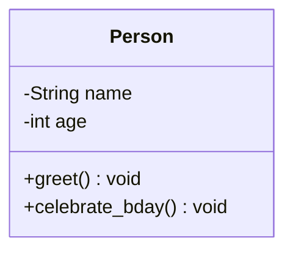

---

## **2. Типы связей между классами**  
### **🔹 Ассоциация (Association)**  
Простая связь между классами (например, "Студент посещает Университет").

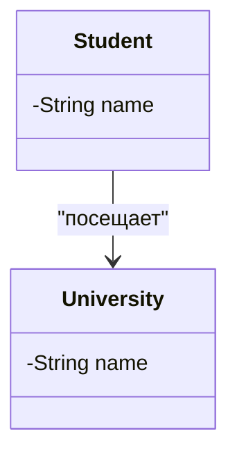

**Код (Python):**  
```python
class University:
    pass

class Student:
    def __init__(self, university):
        self.university = university  # Ассоциация
```

**Код (C++):**  
```cpp
class University {};

class Student {
    University* university;  // Ассоциация (через указатель)
public:
    Student(University* uni) : university(uni) {}
};
```

---

### **🔹 Агрегация (Aggregation)**  
Связь "часть-целое", где часть может существовать без целого.

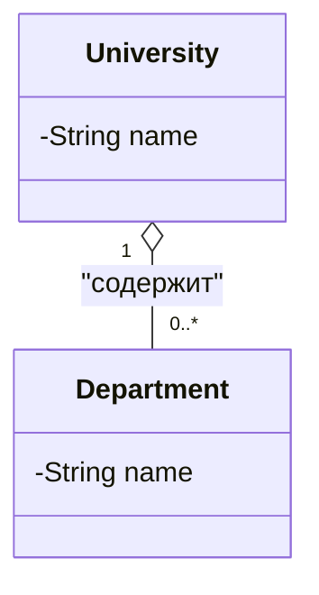

**Python:**  
```python
class Department:
    pass

class University:
    def __init__(self):
        self.departments = []  # Агрегация
```

**C++:**  
```cpp
class Department {};

class University {
    vector<Department*> departments;
public:
    void addDepartment(Department* dept) {
        departments.push_back(dept);
    }
};
```

---

### **🔹 Композиция (Composition)**  
Строгая связь "часть-целое", где часть не может существовать без целого.

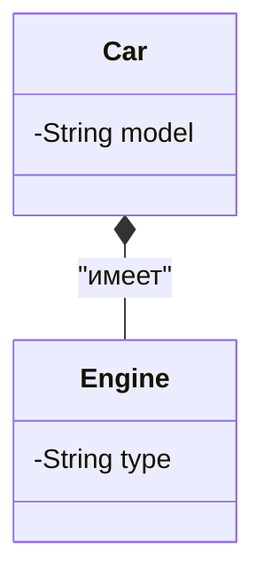

**Python:**  
```python
class Engine:
    def __init__(self, car_model):
        self.car_model = car_model

class Car:
    def __init__(self, model):
        self.engine = Engine(model)  # Композиция
```

**C++:**  
```cpp
class Engine {
    string carModel;
public:
    Engine(string model) : carModel(model) {}
};

class Car {
    Engine engine;  // Композиция
public:
    Car(string model) : engine(model) {}
};
```

---

### **🔹 Наследование (Inheritance)**  
Связь "родитель-потомок".

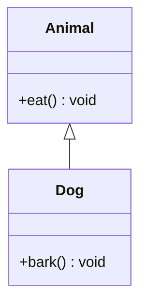

**Python:**  
```python
class Animal:
    pass

class Dog(Animal):  # Наследование
    pass
```

**C++:**  
```cpp
class Animal {};

class Dog : public Animal {};  // Наследование
```

---

## **3. Пример полной UML-диаграммы**  

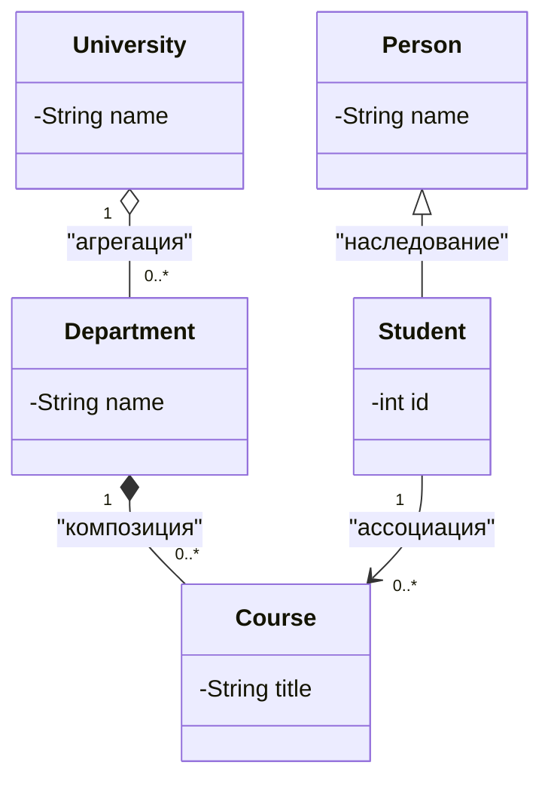

---

## **4. Зачем использовать UML?**  
- 📌 **Визуализация** сложных систем  
- 📄 **Документирование** архитектуры  
- 🔍 **Обнаружение проблем** проектирования  
- 🎯 **Стандартизация** в команде  

---

## **Итог**  
- UML-диаграммы классов **упрощают проектирование** ООП-систем  
- Основные связи: **ассоциация, агрегация, композиция, наследование**  

# **21. Проектирование конструкторов в ООП**

Конструкторы — это специальные методы, отвечающие за инициализацию объектов. Рассмотрим ключевые аспекты их проектирования на Python и C++.

---

## **1. Основные типы конструкторов**

### **1.1 Конструктор по умолчанию**
Инициализирует объект значениями по умолчанию.

**Python:**
```python
class Robot:
    def __init__(self, name="Unknown"):
        self.name = name

robot = Robot()  # name = "Unknown"
```

**C++:**
```cpp
class Robot {
public:
    std::string name;
    Robot(std::string n = "Unknown") : name(n) {}
};

Robot robot;  // name = "Unknown"
```

---

### **1.2 Параметризованный конструктор**
Принимает обязательные параметры для инициализации.

**Python:**
```python
class User:
    def __init__(self, login, password):
        self.login = login
        self.password = password
```

**C++:**
```cpp
class User {
public:
    std::string login;
    std::string password;
    User(std::string l, std::string p) : login(l), password(p) {}
};
```

---

### **1.3 Конструктор копирования (C++)**
Создает копию существующего объекта.

**C++:**
```cpp
class Buffer {
    int* data;
    size_t size;
public:
    Buffer(const Buffer& other) : size(other.size) {
        data = new int[size];
        std::copy(other.data, other.data + size, data);
    }
};
```

---

## **2. Лучшие практики**

1. **Полная инициализация**  
   Все поля должны быть инициализированы в конструкторе.

2. **Проверка входных данных**  
   ```python
   def __init__(self, age):
       if age < 0:
           raise ValueError("Age cannot be negative")
       self.age = age
   ```

3. **Избегание сложной логики**  
   Выносите сложные операции в отдельные методы.

---

## **4. Сравнение Python и C++**

| Характеристика       | Python                      | C++                          |
|----------------------|----------------------------|------------------------------|
| Имя конструктора     | `__init__`                 | Имя класса                  |
| Перегрузка           | Через аргументы по умолчанию | Поддерживается явно         |
| Конструктор копирования | `__copy__`, `__deepcopy__` | `ClassName(const ClassName&)` |

---

## **5. Пример проектирования**

```python
class DatabaseConnection:
    def __init__(self, host, port):
        self.host = host
        self.port = port
        self._validate_connection()

    @classmethod
    def from_config(cls, path):
        config = load_config(path)
        return cls(config['host'], config['port'])
```
---

# **22. Обработка ошибок в ООП**

Рассмотрим стратегии обработки ошибок в Python и C++ с примерами и сравнением подходов.

---

## **1. Основные стратегии обработки ошибок**

### **1.1 Игнорирование проблем**
**Когда использовать:** В некритичных операциях, где ошибка не влияет на работу программы.

**Python:**
```python
try:
    result = 10 / 0
except ZeroDivisionError:
    pass  # Игнорируем ошибку
```

**C++:**
```cpp
try {
    int result = 10 / 0;
} catch (...) {
    // Игнорируем все исключения
}
```

**Риски:** Может привести к неожиданному поведению программы.

---

### **1.2 Проверка и прерывание**
**Когда использовать:** В критических операциях, где продолжение работы невозможно.

**Python:**
```python
if denominator == 0:
    print("Ошибка: деление на ноль")
    sys.exit(1)  # Аварийное завершение
```

**C++:**
```cpp
if (denominator == 0) {
    std::cerr << "Ошибка: деление на ноль" << std::endl;
    exit(EXIT_FAILURE);  // Аварийное завершение
}
```

**Преимущества:** Явное указание на критическую ошибку.

---

### **1.3 Проверка и восстановление**
**Когда использовать:** Когда ошибку можно обработать и продолжить работу.

**Python:**
```python
try:
    file = open("config.txt")
except FileNotFoundError:
    file = open("default_config.txt")  # Попытка восстановления
```

**C++:**
```cpp
std::ifstream file("config.txt");
if (!file.is_open()) {
    file.open("default_config.txt");  // Попытка восстановления
}
```

---

### **1.4 Выброс исключений**
**Когда использовать:** Для обработки ошибок на разных уровнях программы.

**Python:**
```python
def calculate_ratio(a, b):
    if b == 0:
        raise ValueError("Denominator cannot be zero")
    return a / b

try:
    result = calculate_ratio(10, 0)
except ValueError as e:
    print(f"Ошибка: {e}")
```

**C++:**
```cpp
double calculateRatio(int a, int b) {
    if (b == 0) {
        throw std::invalid_argument("Denominator cannot be zero");
    }
    return static_cast<double>(a) / b;
}

try {
    double result = calculateRatio(10, 0);
} catch (const std::exception& e) {
    std::cerr << "Ошибка: " << e.what() << std::endl;
}
```

---

## **2. Сравнение обработки ошибок в Python и C++**

| **Критерий**          | **Python**                          | **C++**                          |
|-----------------------|------------------------------------|----------------------------------|
| **Синтаксис**         | `try/except/else/finally`          | `try/catch`                      |
| **Типы исключений**   | Все исключения - классы            | Базовый класс `std::exception`   |
| **Блок finally**      | Есть (`finally`)                   | Нет (используют деструкторы)     |
| **Необработанные исключения** | Печатает traceback          | Вызывает `std::terminate()`      |

# **23. Область видимости и атрибуты в ООП**

Рассмотрим важность областей видимости и типы атрибутов в Python и C++ с примерами и сравнением.

---

## **1. Области видимости**

#### **1.1 Локальные переменные**
Существуют только внутри блока/функции.

**Python:**
```python
def calculate():
    result = 10 * 2  # Локальная переменная
    return result

print(calculate())  # 20
# print(result)  # Ошибка! Переменная не существует
```

**C++:**
```cpp
void calculate() {
    int result = 10 * 2;  // Локальная переменная
    std::cout << result;
}  // result уничтожается здесь

int main() {
    calculate();  // 20
    // std::cout << result;  // Ошибка компиляции
    return 0;
}
```

---

#### **1.2 Глобальные переменные**
Доступны во всей программе (использовать с осторожностью).

**Python:**
```python
count = 0  # Глобальная переменная

def increment():
    global count
    count += 1

increment()
print(count)  # 1
```

**C++:**
```cpp
int count = 0;  // Глобальная переменная

void increment() {
    count++;
}

int main() {
    increment();
    std::cout << count;  // 1
    return 0;
}
```

---

## **2. Атрибуты объектов и классов**

### **2.1 Атрибуты объектов (instance attributes)**
Принадлежат конкретному экземпляру класса.

**Python:**
```python
class Robot:
    def __init__(self, name):
        self.name = name  # Атрибут объекта

r1 = Robot("R2-D2")
print(r1.name)  # R2-D2
```

**C++:**
```cpp
class Robot {
public:
    std::string name;  // Атрибут объекта
    Robot(std::string n) : name(n) {}
};

Robot r1("R2-D2");
std::cout << r1.name;  // R2-D2
```

---

### **2.2 Атрибуты классов (class attributes)**
Общие для всех экземпляров класса.

**Python:**
```python
class Robot:
    count = 0  # Атрибут класса

    def __init__(self):
        Robot.count += 1

print(Robot.count)  # 0
r1 = Robot()
print(r1.count)     # 1
```

**C++ (static members):**
```cpp
class Robot {
public:
    static int count;  // Атрибут класса
    Robot() { count++; }
};

int Robot::count = 0;  // Инициализация

int main() {
    std::cout << Robot::count;  // 0
    Robot r1;
    std::cout << r1.count;      // 1
    return 0;
}
```

---

## **3. Сравнение Python и C++**

| Характеристика       | Python                          | C++                            |
|----------------------|---------------------------------|--------------------------------|
| **Локальные переменные** | Существуют в функции        | Существуют в блоке `{}`        |
| **Глобальные переменные** | `global` ключевое слово     | Объявляются вне функций        |
| **Атрибуты объектов** | `self.attribute`             | Члены класса (public/private)  |
| **Атрибуты классов**  | Переменная в теле класса     | `static` члены класса          |
| **Инкапсуляция**      | Условная (`_` и `__`)        | Строгая (`private/protected`)  |

---

# **24. Перегрузка операторов в ООП**

Перегрузка операторов позволяет задать особое поведение операторов (`+`, `-`, `==` и др.) для пользовательских классов. Рассмотрим реализацию в Python и C++.

---

## **1. Основные принципы**

#### **Когда использовать:**
- Для работы с математическими объектами (векторы, матрицы)
- Для создания интуитивно понятного интерфейса
- Для эмуляции поведения встроенных типов

#### **Ограничения:**
- Не все операторы можно перегружать
- Нельзя создавать новые операторы
- Нельзя изменить приоритет операторов

---

## **2. Перегрузка в Python**

### **2.1 Список перегружаемых операторов**
| Оператор | Метод          | Пример       |
|----------|----------------|--------------|
| `+`      | `__add__`      | `a + b`      |
| `-`      | `__sub__`      | `a - b`      |
| `*`      | `__mul__`      | `a * b`      |
| `==`     | `__eq__`       | `a == b`     |
| `[]`     | `__getitem__`  | `a[0]`       |
| `()`     | `__call__`     | `a()`        |

### **2.2 Пример: Класс Vector**
```python
class Vector:
    def __init__(self, x, y):
        self.x = x
        self.y = y
    
    def __add__(self, other):  # Перегрузка +
        return Vector(self.x + other.x, self.y + other.y)
    
    def __mul__(self, scalar):  # Перегрузка *
        return Vector(self.x * scalar, self.y * scalar)
    
    def __eq__(self, other):   # Перегрузка ==
        return self.x == other.x and self.y == other.y
    
    def __str__(self):         # Перегрузка str()
        return f"Vector({self.x}, {self.y})"

# Использование
v1 = Vector(2, 3)
v2 = Vector(1, 1)
print(v1 + v2)    # Vector(3, 4)
print(v1 * 3)     # Vector(6, 9)
print(v1 == v2)   # False
```

---

## **3. Перегрузка в C++**

### **3.1 Список перегружаемых операторов**
| Оператор | Метод                     | Пример       |
|----------|---------------------------|--------------|
| `+`      | `operator+`               | `a + b`      |
| `-`      | `operator-`               | `a - b`      |
| `*`      | `operator*`               | `a * b`      |
| `==`     | `operator==`              | `a == b`     |
| `[]`     | `operator[]`              | `a[0]`       |
| `()`     | `operator()`              | `a()`        |

### **3.2 Пример: Класс Vector**
```cpp
#include <iostream>
#include <string>

class Vector {
    double x, y;
public:
    Vector(double x, double y) : x(x), y(y) {}
    
    Vector operator+(const Vector& other) const {
        return Vector(x + other.x, y + other.y);
    }
    
    Vector operator*(double scalar) const {
        return Vector(x * scalar, y * scalar);
    }
    
    bool operator==(const Vector& other) const {
        return x == other.x && y == other.y;
    }
    
    friend std::ostream& operator<<(std::ostream& os, const Vector& v) {
        return os << "Vector(" << v.x << ", " << v.y << ")";
    }
};

int main() {
    Vector v1(2, 3);
    Vector v2(1, 1);
    
    std::cout << (v1 + v2) << std::endl;  // Vector(3, 4)
    std::cout << (v1 * 3) << std::endl;   // Vector(6, 9)
    std::cout << (v1 == v2) << std::endl; // 0 (false)
    
    return 0;
}
```

---

## **4. Особенности перегрузки**

### **4.1 В Python**
- Можно перегружать **большинство** операторов
- Есть **правосторонние** методы (`__radd__`, `__rsub__`)
- Поддержка **составных операторов** (`+=` через `__iadd__`)

**Пример правостороннего сложения:**
```python
class Vector:
    def __radd__(self, other):
        return self + other  # Если левый операнд не поддерживает +
```

### **4.2 В C++**
- Можно перегружать **только существующие** операторы
- Можно определять как **методы класса** или **глобальные функции**
- **Операторы присваивания** (`+=`, `-=`) перегружаются отдельно

**Пример перегрузки через дружественную функцию:**
```cpp
Vector operator*(double scalar, const Vector& v) {
    return v * scalar;  // Коммутативность умножения
}
```

---

## **5. Сравнение Python и C++**

| Характеристика       | Python                          | C++                            |
|----------------------|---------------------------------|--------------------------------|
| **Синтаксис**        | `__add__`, `__eq__`            | `operator+`, `operator==`      |
| **Типы операторов**  | Арифметические, сравнения, индексации | Те же + присваивание |
| **Правосторонние**   | Поддерживается (`__radd__`)     | Через дружественные функции    |
| **Составные операторы** | `__iadd__` для `+=`         | `operator+=` отдельно          |

---

# **25. Множественное наследование в ООП**

Множественное наследование позволяет классу наследовать функциональность от **нескольких родительских классов**. Рассмотрим реализацию в Python и C++ с примерами, проблемами и лучшими практиками.

---

## **1. Основные концепции**

### **1.1 Простое vs Множественное наследование**
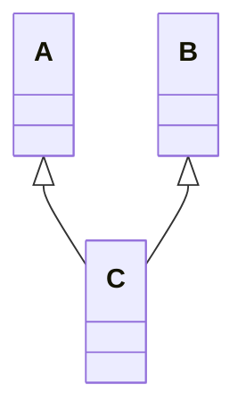

### **1.2 Когда использовать?**
- Для создания **миксинов** (добавление функциональности)
- Для реализации **интерфейсов** (в C++)
- Для комбинирования **независимых возможностей**

---

## **2. Реализация в Python**

### **2.1 Базовый пример**
```python
class Printer:
    def print(self, text):
        print(f"Printing: {text}")

class Scanner:
    def scan(self):
        return "Scanned data"

class MultiFunctionDevice(Printer, Scanner):
    pass

mfd = MultiFunctionDevice()
mfd.print("Hello")  # Из Printer
print(mfd.scan())   # Из Scanner
```

### **2.2 Проблема ромбовидного наследования**
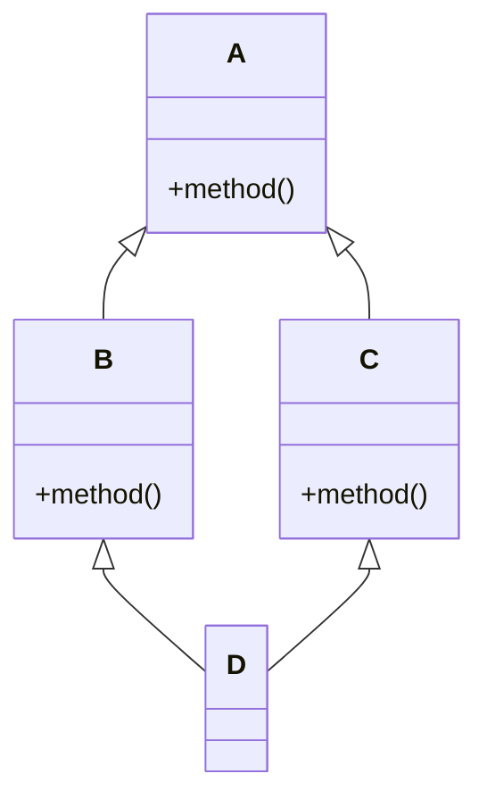

**Решение через MRO (Method Resolution Order):**
```python
class A:
    def method(self):
        print("A")

class B(A):
    def method(self):
        print("B")

class C(A):
    def method(self):
        print("C")

class D(B, C):
    pass

d = D()
d.method()  # Выведет "B" (порядок: D → B → C → A)
print(D.__mro__)  # Показывает порядок поиска методов
```

---

## **3. Реализация в C++**

### **3.1 Базовый пример**
```cpp
#include <iostream>

class Printer {
public:
    void print(const std::string& text) {
        std::cout << "Printing: " << text << "\n";
    }
};

class Scanner {
public:
    std::string scan() {
        return "Scanned data";
    }
};

class MultiFunctionDevice : public Printer, public Scanner {};

int main() {
    MultiFunctionDevice mfd;
    mfd.print("Hello");
    std::cout << mfd.scan() << "\n";
    return 0;
}
```

### **3.2 Проблема ромбовидного наследования**
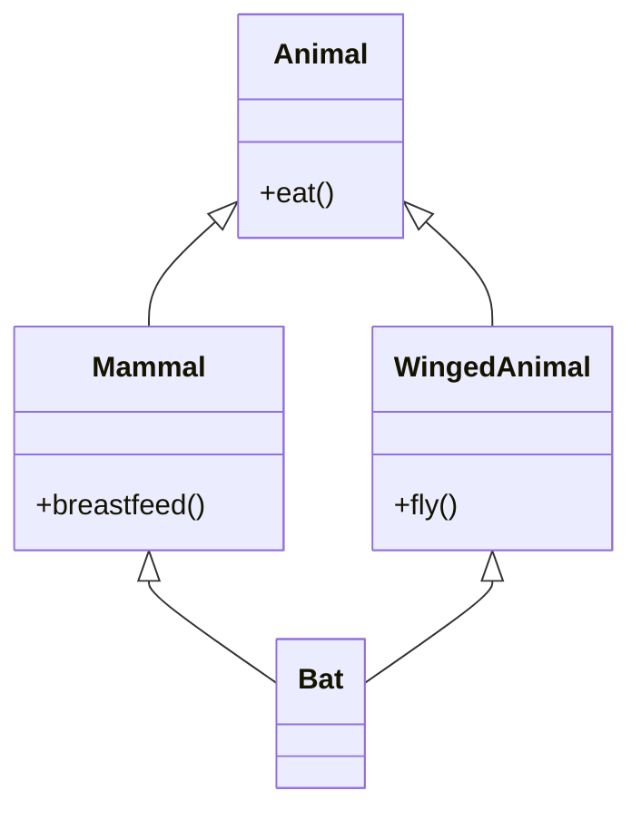

**Решение через виртуальное наследование:**
```cpp
class Animal {
public:
    void eat() { std::cout << "Eating\n"; }
};

class Mammal : virtual public Animal {
public:
    void breastfeed() { std::cout << "Breastfeeding\n"; }
};

class WingedAnimal : virtual public Animal {
public:
    void fly() { std::cout << "Flying\n"; }
};

class Bat : public Mammal, public WingedAnimal {};

int main() {
    Bat bat;
    bat.eat();  // Без virtual было бы неоднозначность
    return 0;
}
```

---

## **4. Сравнение Python и C++**

| Характеристика       | Python                          | C++                            |
|----------------------|---------------------------------|--------------------------------|
| **Синтаксис**        | `class D(B, C)`                | `class D : public B, public C` |
| **Разрешение методов** | MRO (порядок в списке)        | Приоритет первого родителя     |
| **Ромбовидное наследование** | Автоматически через MRO    | Требует `virtual`              |
| **Интерфейсы**       | Нет (используют абстрактные классы) | Чисто виртуальные функции |

---

# **26. Операции с объектами в ООП**

Операции с объектами включают создание, копирование, сравнение и другие манипуляции. Рассмотрим основные операции в Python и C++ с примерами.

---

## **1. Создание объектов**

### **Python:**
```python
class Car:
    def __init__(self, model):
        self.model = model

# Создание экземпляра
car = Car("Toyota")
```

### **C++:**
```cpp
class Car {
public:
    std::string model;
    Car(std::string m) : model(m) {}
};

// Создание экземпляра
Car car("Toyota");
```

---

## **2. Копирование объектов**

### **2.1 Поверхностное копирование (shallow copy)**
Копирует только ссылки на вложенные объекты.

**Python:**
```python
import copy

car1 = Car("Toyota")
car2 = copy.copy(car1)  # Поверхностная копия
```

**C++:**
```cpp
Car car1("Toyota");
Car car2 = car1;  // Поверхностная копия (если нет конструктора копирования)
```

### **2.2 Глубокое копирование (deep copy)**
Копирует все вложенные объекты.

**Python:**
```python
car3 = copy.deepcopy(car1)  # Глубокая копия
```

**C++:**
```cpp
class Car {
public:
    std::string* details;  // Динамические данные
    Car(const Car& other) {  // Конструктор копирования
        details = new std::string(*other.details);
    }
};
```

---

## **3. Сравнение объектов**

### **Python:**
```python
class Book:
    def __init__(self, title):
        self.title = title
    
    def __eq__(self, other):  # Перегрузка ==
        return self.title == other.title

book1 = Book("1984")
book2 = Book("1984")
print(book1 == book2)  # True
```

### **C++:**
```cpp
class Book {
public:
    std::string title;
    bool operator==(const Book& other) const {
        return title == other.title;
    }
};

Book book1{"1984"};
Book book2{"1984"};
std::cout << (book1 == book2);  // 1 (true)
```

---

## **4. Удаление объектов**

### **Python (сборщик мусора):**
```python
del car  # Удаление ссылки (объект удалится при сборке мусора)
```

### **C++ (ручное управление):**
```cpp
Car* car = new Car("BMW");
delete car;  // Явное удаление
```
---

## **5. Итерация по объектам**

### **Python:**
```python
class Library:
    def __init__(self):
        self.books = ["1984", "Dune"]
    
    def __iter__(self):
        return iter(self.books)

lib = Library()
for book in lib:  # Итерация
    print(book)
```

### **C++:**
```cpp
class Library {
    std::vector<std::string> books{"1984", "Dune"};
public:
    auto begin() { return books.begin(); }
    auto end() { return books.end(); }
};

Library lib;
for (auto& book : lib) {  // Итерация
    std::cout << book;
}
```

---

## **6. Сравнение Python и C++**

| Операция          | Python                          | C++                            |
|-------------------|---------------------------------|--------------------------------|
| **Создание**      | `obj = Class()`                | `Class obj(args)`              |
| **Копирование**   | `copy.copy()` / `deepcopy()`   | Конструктор копирования        |
| **Сравнение**     | `__eq__`, `__lt__`             | `operator==`, `operator<`      |
| **Удаление**      | Сборщик мусора                 | `delete`                       |
| **Сериализация**  | `pickle`                       | Библиотеки (Boost, protobuf)   |
| **Итерация**      | `__iter__`, `__next__`         | `begin()`, `end()`             |

---

# **27. Анатомия класса: Имя класса и структура**

Класс — это фундаментальная конструкция в ООП, объединяющая данные и поведение. Рассмотрим ключевые элементы на примерах Python и C++.

---

## **1. Имя класса**
#### **Требования:**
- Должно быть **существительным** в PascalCase
- Должно отражать **сущность** (не процесс или действие)
- В Python принято **без ограничений**, в C++ — без пробелов и спецсимволов

**Примеры имен:**
- `BankAccount` (✅ правильно)
- `process_data` (❌ глагол, подходит для функции)
- `UserManager` (✅ сущность + уточнение)

---

## **2. Полная анатомия класса**

### **2.1 В Python**
```python
class ClassName:  # Имя класса (PascalCase)
    """Docstring: описание назначения класса"""  # Документация
    
    class_attribute = value  # Атрибут класса (общий для всех экземпляров)
    
    def __init__(self, args):  # Конструктор
        self.instance_attribute = args  # Атрибут экземпляра
    
    def method(self):  # Метод экземпляра
        return self.instance_attribute
    
    @classmethod
    def class_method(cls):  # Метод класса
        return cls.class_attribute
    
    @staticmethod
    def static_method():  # Статический метод
        return "Не требует self/cls"
    
    def __str__(self):  # Специальный метод
        return f"Строковое представление"
```

### **2.2 В C++**
```cpp
class ClassName {  // Имя класса (PascalCase)
public:  // Секция доступа
    // Конструктор
    ClassName(type arg) : member(arg) {}  
    
    // Метод экземпляра
    type method() const { return member; }  
    
    // Статический метод
    static void staticMethod() { /* ... */ }  

private:  // Инкапсуляция
    type member;  // Поле класса
    static type class_member;  // Статическое поле
};

// Инициализация статического поля
type ClassName::class_member = value;
```

---

## **3. Ключевые отличия Python и C++**

| Элемент            | Python                          | C++                            |
|--------------------|---------------------------------|--------------------------------|
| **Объявление**     | `class Name:`                  | `class Name { ... };`          |
| **Документация**   | Обязательный `docstring`       | Комментарии `/** */`           |
| **Инкапсуляция**   | Условная (`_` и `__`)          | Строгая (`public/protected/private`) |
| **Конструктор**    | `__init__`                     | `ClassName()`                  |
| **Деструктор**     | `__del__`                      | `~ClassName()`                 |
| **Статические поля** | Внутри класса                | Требуют отдельной инициализации |

---

# **28. Анатомия класса: Комментарии**

Комментарии — важная часть документации кода, помогающая понять назначение и работу класса. Рассмотрим лучшие практики комментирования в Python и C++.

---

## **1. Типы комментариев**

### **1.1 Документирующие комментарии (для пользователей класса)**
#### Python: Docstrings
```python
class Vector:
    """Класс для работы с 2D-векторами.
    
    Attributes:
        x (float): Координата по оси X
        y (float): Координата по оси Y
    """
    
    def __init__(self, x, y):
        self.x = x
        self.y = y
```

#### C++: Doxygen
```cpp
/**
 * @class Vector
 * @brief Класс для работы с 2D-векторами
 */
class Vector {
public:
    /**
     * @brief Конструктор вектора
     * @param x Координата по оси X
     * @param y Координата по оси Y
     */
    Vector(double x, double y) : x(x), y(y) {}
    
private:
    double x; ///< Координата X
    double y; ///< Координата Y
};
```

### **1.2 Поясняющие комментарии (для разработчиков)**
```python
def normalize(self):
    # Вычисляем длину вектора для избежания деления на 0
    length = self.length()
    if abs(length) < 1e-10:  # Машинный ноль
        return Vector(0, 0)
    return Vector(self.x / length, self.y / length)
```

```cpp
void normalize() {
    // Проверка на нулевую длину с учетом погрешности float
    const double epsilon = 1e-10;
    double len = length();
    if (std::abs(len) < epsilon) {
        x = y = 0.0;
        return;
    }
    x /= len; y /= len;
}
```

---

## **2. Лучшие практики комментирования**

### **2.1 Что комментировать?**
- Назначение класса и его общую логику
- Неочевидные алгоритмы
- Ограничения и предостережения
- Причины нестандартных решений

### **2.2 Чего избегать?**
- Избыточных комментариев для очевидного кода
- Устаревших комментариев (не соответствующих коду)
- Комментариев-извинений ("здесь костыль")

---

## **3. Специфичные комментарии**

### **3.1 TODO-комментарии**
```python
class Database:
    def connect(self):
        # TODO: Реализовать таймаут подключения
        raise NotImplementedError
```

```cpp
class Database {
public:
    void connect() {
        // TODO: Добавить обработку ошибок подключения
        throw std::runtime_error("Not implemented");
    }
};
```

### **3.2 Предупреждения**
```python
def legacy_method(self):
    # WARNING: Не использовать в новых версиях API
    # Будет удалено в v3.0
    pass
```

```cpp
void deprecatedFunction() {
    // DEPRECATED: Заменен на newAPI::function()
    // Удаление запланировано в 2025Q1
}
```

# **29. Анатомия класса: Атрибуты**

Атрибуты класса определяют его состояние и данные. Рассмотрим их типы, особенности и лучшие практики в Python и C++.

---

## **1. Типы атрибутов**

### **1.1 Атрибуты экземпляра (instance attributes)**
Принадлежат конкретному объекту.

**Python:**
```python
class Car:
    def __init__(self, model):
        self.model = model  # Атрибут экземпляра

car = Car("Toyota")
print(car.model)  # Toyota
```

**C++:**
```cpp
class Car {
public:
    std::string model;  // Атрибут экземпляра
    Car(std::string m) : model(m) {}
};

Car car("Toyota");
std::cout << car.model;  // Toyota
```

---

### **1.2 Атрибуты класса (class attributes)**
Общие для всех экземпляров.

**Python:**
```python
class Car:
    wheels = 4  # Атрибут класса

print(Car.wheels)  # 4
car = Car()
print(car.wheels)  # 4
```

**C++ (static members):**
```cpp
class Car {
public:
    static int wheels;  // Объявление
};
int Car::wheels = 4;   // Инициализация

std::cout << Car::wheels;  // 4
```

---

### **1.3 Константные атрибуты**
Неизменяемые значения.

**Python (условно):**
```python
class Math:
    PI = 3.14159  # Константа класса (но технически изменяема)
```

**C++ (настоящие константы):**
```cpp
class Math {
public:
    static constexpr double PI = 3.14159;  // Настоящая константа
};
```

---

## **2. Уровни доступа**

### **2.1 В Python**
- **Публичные:** `self.public`
- **Защищенные:** `self._protected` (соглашение)
- **Приватные:** `self.__private` (name mangling)

```python
class AccessExample:
    def __init__(self):
        self.public = 1      # Доступно везде
        self._protected = 2  # Условно защищенное
        self.__private = 3   # Имя преобразуется в _AccessExample__private

obj = AccessExample()
print(obj.public)      # 1
print(obj._protected)  # 2 (но не рекомендуется)
# print(obj.__private) # Ошибка!
```

### **2.2 В C++**
- **public:** Доступ везде
- **protected:** Только классу и наследникам
- **private:** Только классу

```cpp
class AccessExample {
public:
    int public_var = 1;
protected:
    int protected_var = 2;
private:
    int private_var = 3;
};

AccessExample obj;
std::cout << obj.public_var;    // OK
// std::cout << obj.protected_var; // Ошибка
// std::cout << obj.private_var;   // Ошибка
```

---

## **3. Свойства (property)**

### **Python: Контроль доступа через @property**
```python
class Temperature:
    def __init__(self, celsius):
        self._celsius = celsius  # Защищенный атрибут

    @property
    def celsius(self):
        return self._celsius

    @celsius.setter
    def celsius(self, value):
        if value < -273.15:
            raise ValueError("Температура ниже абсолютного нуля")
        self._celsius = value

temp = Temperature(25)
print(temp.celsius)  # 25
temp.celsius = 30    # Используем setter
```

### **C++: Геттеры/сеттеры**
```cpp
class Temperature {
    double celsius_;
public:
    double getCelsius() const { return celsius_; }
    void setCelsius(double value) {
        if (value < -273.15) {
            throw std::invalid_argument("Температура ниже абсолютного нуля");
        }
        celsius_ = value;
    }
};

Temperature temp;
temp.setCelsius(25);
std::cout << temp.getCelsius();
```

---

## **4. Динамические атрибуты**

### **Python: __dict__ и __slots__**
```python
class DynamicClass:
    pass

obj = DynamicClass()
obj.new_attr = 42  # Динамическое добавление
print(obj.new_attr)

# Оптимизация памяти через __slots__
class FixedClass:
    __slots__ = ['attr1', 'attr2']  # Фиксированный набор атрибутов
    def __init__(self):
        self.attr1 = 1
        self.attr2 = 2
```

### **C++: Фиксированная структура**
```cpp
// В C++ нельзя динамически добавлять поля
class FixedClass {
public:
    int attr1;
    int attr2;
};
```

---

## **5. Инициализация атрибутов**

### **Python: Поздняя инициализация**
```python
class LazyInit:
    def __init__(self):
        self.data = None  # Инициализация при первом использовании
    
    def load_data(self):
        if self.data is None:
            self.data = "Загруженные данные"
```

### **C++: Конструкторы и списки инициализации**
```cpp
class EfficientInit {
    std::string data;
public:
    EfficientInit() : data("Значение по умолчанию") {}  // Рекомендуемый способ
    
    EfficientInit() {  // Менее эффективно
        data = "Значение по умолчанию";
    }
};
```

---

## **6. Сравнение Python и C++**

| Характеристика       | Python                          | C++                            |
|----------------------|---------------------------------|--------------------------------|
| **Атрибуты экземпляра** | Динамические                 | Фиксированные                 |
| **Атрибуты класса**  | В теле класса                 | `static` члены                |
| **Инкапсуляция**     | Условная (`_`, `__`)          | Строгая (`private/protected`) |
| **Свойства**         | `@property`                   | Геттеры/сеттеры               |
| **Динамические поля** | Поддерживаются               | Не поддерживаются             |

---

# **30. Анатомия класса: Конструкторы**

Конструкторы — специальные методы, инициализирующие объект при создании. Рассмотрим их виды и особенности в Python и C++.

---

## **1. Основные типы конструкторов**

### **1.1 Обычный конструктор**
#### Python (`__init__`):
```python
class Robot:
    def __init__(self, name, power=100):
        self.name = name    # Обязательный параметр
        self.power = power  # Параметр по умолчанию

r = Robot("R2-D2", 80)
```

#### C++ (имя совпадает с классом):
```cpp
class Robot {
public:
    std::string name;
    int power;
    
    Robot(std::string n, int p = 100) 
        : name(n), power(p) {}  // Список инициализации
};

Robot r("R2-D2", 80);
```

---

### **1.2 Конструктор копирования**
#### Python (через `__deepcopy__`):
```python
import copy

class Vector:
    def __init__(self, x, y):
        self.coords = [x, y]
    
    def __deepcopy__(self, memo):
        return Vector(*self.coords)

v1 = Vector(1, 2)
v2 = copy.deepcopy(v1)  # Глубокая копия
```

#### C++ (`ClassName(const ClassName&)`):
```cpp
class Vector {
    int* data;
    size_t size;
public:
    Vector(const Vector& other) : size(other.size) {
        data = new int[size];
        std::copy(other.data, other.data + size, data);
    }
};

Vector v1(10);
Vector v2 = v1;  // Вызов конструктора копирования
```

---

### **1.3 Конструктор перемещения (только C++11+)**
```cpp
class Buffer {
    char* data;
public:
    Buffer(Buffer&& other) noexcept 
        : data(other.data) {  // "Перехватываем" ресурсы
        other.data = nullptr; // Обнуляем исходный объект
    }
};

Buffer create_buffer();
Buffer b = create_buffer();  // Вызов перемещающего конструктора
```

---

## **2. Особенности конструкторов**

### **2.1 В Python**
- Нет перегрузки конструкторов (используют параметры по умолчанию)
- Можно эмулировать через `@classmethod`:
```python
class Person:
    def __init__(self, name):
        self.name = name
    
    @classmethod
    def from_birth_year(cls, name, birth_year):
        age = 2023 - birth_year
        return cls(f"{name} ({age} лет)")

p = Person.from_birth_year("Иван", 1990)
```

### **2.2 В C++**
- Можно перегружать конструкторы
- Делегирующие конструкторы (C++11):
```cpp
class Circle {
    double radius;
    std::string color;
public:
    Circle(double r) : radius(r), color("black") {}
    Circle(double r, std::string c) : Circle(r) { color = c; }
};
```

---

## **3. Лучшие практики**

### **3.1 Общие принципы**
- **Полная инициализация**: Все поля должны быть проинициализированы
- **Проверка входных данных**:
  ```python
  def __init__(self, age):
      if age < 0:
          raise ValueError("Age cannot be negative")
  ```
  ```cpp
  Person(int age) : age(age) {
      if (age < 0) throw std::invalid_argument("Age cannot be negative");
  }
  ```

### **3.2 Для C++**
- **Список инициализации** предпочтительнее присваивания в теле:
  ```cpp
  // Хорошо:
  Circle(double r) : radius(r) {}
  
  // Плохо:
  Circle(double r) { radius = r; }
  ```
- **Правило пяти**: Если класс управляет ресурсами, реализуйте:
  1. Деструктор
  2. Конструктор копирования
  3. Оператор копирования
  4. Конструктор перемещения
  5. Оператор перемещения

### **3.3 Для Python**
- **Минимизируйте логику в `__init__`** (выносите в отдельные методы)
- **Используйте `__post_init__`** (в dataclasses) для дополнительной настройки:
```python
from dataclasses import dataclass

@dataclass
class Point:
    x: float
    y: float
    
    def __post_init__(self):
        self.distance = (self.x**2 + self.y**2)**0.5
```

---

## **4. Сравнение Python и C++**

| Характеристика       | Python                          | C++                            |
|----------------------|---------------------------------|--------------------------------|
| **Имя конструктора** | `__init__`                     | Имя класса                    |
| **Перегрузка**       | Нет (используют параметры по умолчанию) | Поддерживается |
| **Конструктор копирования** | `__deepcopy__`          | `ClassName(const ClassName&)` |
| **Делегирование**    | Через `@classmethod`           | `: ClassName(args)`           |
| **Инициализация полей** | В теле метода               | В списке инициализации        |

---

# **31. Анатомия класса: Методы доступа**

Методы доступа (accessors) — это методы для контролируемого доступа к атрибутам класса. Они обеспечивают инкапсуляцию и безопасность данных.

---

## **1. Типы методов доступа**

### **1.1 Геттеры (getters)**
Возвращают значение атрибута.

#### Python (`@property`):
```python
class BankAccount:
    def __init__(self):
        self._balance = 0  # Защищенный атрибут

    @property
    def balance(self):
        """Возвращает текущий баланс"""
        return self._balance

account = BankAccount()
print(account.balance)  # Вызов геттера
```

#### C++:
```cpp
class BankAccount {
    double balance_;
public:
    double getBalance() const { return balance_; }
};

BankAccount account;
std::cout << account.getBalance();
```

---

### **1.2 Сеттеры (setters)**
Устанавливают значение атрибута с проверками.

#### Python (`@property.setter`):
```python
class BankAccount:
    @property
    def balance(self):
        return self._balance

    @balance.setter
    def balance(self, value):
        if value < 0:
            raise ValueError("Баланс не может быть отрицательным")
        self._balance = value

account = BankAccount()
account.balance = 100  # Вызов сеттера
```

#### C++:
```cpp
class BankAccount {
    double balance_;
public:
    void setBalance(double value) {
        if (value < 0) throw std::invalid_argument("Баланс не может быть отрицательным");
        balance_ = value;
    }
};

BankAccount account;
account.setBalance(100);
```

---

## **2. Преимущества методов доступа**

1. **Контроль значений**:
   ```python
   @age.setter
   def age(self, value):
       if not 0 <= value <= 120:
           raise ValueError("Недопустимый возраст")
       self._age = value
   ```

2. **Логирование изменений**:
   ```cpp
   void setName(std::string name) {
       std::cout << "Изменение имени с " << this->name << " на " << name;
       this->name = name;
   }
   ```

3. **Вычисляемые значения**:
   ```python
   @property
   def full_name(self):
       return f"{self.first_name} {self.last_name}"
   ```

4. **Совместимость**:
   - Можно изменить внутреннюю реализацию, не меняя API

---

## **3. Сравнение Python и C++**

| Характеристика       | Python (`@property`)          | C++ (геттеры/сеттеры)        |
|----------------------|-------------------------------|------------------------------|
| **Синтаксис**        | Декораторы                    | Отдельные методы             |
| **Вызов**            | Как атрибут (`obj.value`)     | Как метод (`obj.getValue()`) |
| **Только чтение**    | `@property` без сеттера       | Только геттер                |
| **Логика в сеттере** | В методе-сеттере              | В методе set                 |
| **Неявный вызов**    | Да                            | Нет                          |

---

## **4. Альтернативные подходы**

### **4.1 В Python: `__getattr__` и `__setattr__`**
Для динамического управления атрибутами:
```python
class DynamicAttributes:
    def __getattr__(self, name):
        if name == "magic":
            return 42
        raise AttributeError(f"Нет атрибута {name}")

    def __setattr__(self, name, value):
        if name == "readonly":
            raise AttributeError("Этот атрибут только для чтения")
        super().__setattr__(name, value)
```

### **4.2 В C++: перегрузка операторов**
Для доступа к элементам массива:
```cpp
class IntArray {
    int data[10];
public:
    int& operator[](size_t index) { return data[index]; }
    const int& operator[](size_t index) const { return data[index]; }
};

IntArray arr;
arr[0] = 42;  // Вызов operator[]
```

---

## **5. Лучшие практики**

1. **Соблюдайте единый стиль**:
   - В Python: используйте `@property` для всех атрибутов с логикой
   - В C++: префиксы `get`/`set` или `Get`/`Set`

2. **Избегайте избыточных геттеров**:
   ```python
   # Плохо:
   class Point:
       @property
       def x(self): return self._x
       @property
       def y(self): return self._y

   # Лучше (если нет логики):
   class Point:
       def __init__(self, x, y):
           self.x = x  # Публичные атрибуты
           self.y = y
   ```

3. **Делайте геттеры `const` в C++**:
   ```cpp
   const std::string& getName() const { return name; }
   ```

4. **Документируйте ограничения**:
   ```python
   @temperature.setter
   def temperature(self, value):
       """Устанавливает температуру в Кельвинах (0-1000)"""
       if not 0 <= value <= 1000:
           raise ValueError("Диапазон: 0-1000K")
       self._temp = value
   ```

---

# **32. Анатомия класса: Методы открытых интерфейсов**

Методы открытых интерфейсов — это публичные методы класса, которые определяют его взаимодействие с внешним миром. Они формируют контракт класса с пользователями его API.

---

## **1. Основные принципы**

### **1.1 Что включать в публичный интерфейс?**
- Методы, необходимые для **основной функциональности**
- Операции, которые **безопасно** вызывать извне
- Минимально необходимый набор для работы с объектом

### **1.2 Что не включать?**
- Вспомогательные методы (`_helper_method`)
- Детали реализации
- Методы, которые могут нарушить целостность объекта

---

## **2. Типы методов открытых интерфейсов**

### **2.1 Методы управления состоянием**
```python
class BankAccount:
    def deposit(self, amount): 
        """Пополнение счета"""
        if amount <= 0:
            raise ValueError("Сумма должна быть положительной")
        self._balance += amount

    def withdraw(self, amount):
        """Снятие средств"""
        if amount > self._balance:
            raise ValueError("Недостаточно средств")
        self._balance -= amount
```

```cpp
class BankAccount {
    double balance_;
public:
    void deposit(double amount) {
        if (amount <= 0) throw std::invalid_argument("Сумма должна быть положительной");
        balance_ += amount;
    }
    
    void withdraw(double amount) {
        if (amount > balance_) throw std::invalid_argument("Недостаточно средств");
        balance_ -= amount;
    }
};
```

### **2.2 Методы запросов (без изменения состояния)**
```python
class Vector:
    def magnitude(self):
        """Возвращает длину вектора"""
        return (self.x**2 + self.y**2)**0.5
```

```cpp
class Vector {
    double x, y;
public:
    double magnitude() const {  // const-метод не меняет объект
        return sqrt(x*x + y*y);
    }
};
```

### **2.3 Фабричные методы**
```python
class Rectangle:
    @classmethod
    def from_coordinates(cls, x1, y1, x2, y2):
        """Создает прямоугольник по координатам углов"""
        width = abs(x2 - x1)
        height = abs(y2 - y1)
        return cls(width, height)
```

```cpp
class Rectangle {
    double width, height;
public:
    static Rectangle fromCoordinates(double x1, double y1, double x2, double y2) {
        return {abs(x2-x1), abs(y2-y1)};
    }
};
```

---

## **3. Лучшие практики проектирования**

### **3.1 Принцип единой ответственности**
Каждый метод должен решать **одну задачу**:
```python
# Плохо:
def process_and_save(self, data):
    self.validate(data)
    self.clean(data)
    self.save(data)

# Лучше:
def process(self, data):
    self.validate(data)
    return self.clean(data)

def save(self, data):
    self._storage.save(data)
```

### **3.2 Информационная экспертиза**
Распределяйте методы по классам, где есть **максимум информации** для их выполнения:
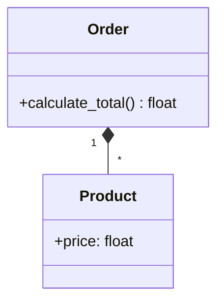

### **3.3 Контроль доступа**
- Python: используйте `_protected` и `__private` соглашения
- C++: явные `private`/`protected` секции

### **3.4 Неизменяемость (immutability)**
Предпочитайте методы, которые **не изменяют** объект:
```python
class String:
    def upper(self):
        """Возвращает новую строку в верхнем регистре"""
        return String(self._value.upper())
```

```cpp
class String {
    std::string data;
public:
    String toUpper() const {  // Не меняет текущий объект
        String result;
        std::transform(data.begin(), data.end(), 
                      result.data.begin(), ::toupper);
        return result;
    }
};
```

---

## **4. Сравнение Python и C++**

| Характеристика       | Python                          | C++                            |
|----------------------|---------------------------------|--------------------------------|
| **Синтаксис**        | `def method(self):`            | `retType method() { ... }`     |
| **Const-методы**     | Нет (соглашения по именованию) | `void method() const;`         |
| **Фабричные методы** | `@classmethod`                 | `static` методы                |
| **Перегрузка**       | Через параметры по умолчанию   | Явная перегрузка               |
| **Видимость**        | `_protected`, `__private`      | `public/protected/private`     |

---
# **33. Анатомия класса. Методы закрытых реализаций**
Не все методы в классе являются частью открытого интерфейса. Методы в том или ином классе обычно скрыты от других классов и объявляются как private:
```cs
private void turnLeft()
{
}
private void turnRight()
{
}
```
Эти закрытые методы призваны быть частью реализации, а не открытого интерфейса.
Вызывать private-методы могут только другие методы того же класса.
```cs
public class Robot {
    // Приватные методы (скрыты от внешнего мира)
    private void turnRight() { 
        System.out.println("Поворачиваю направо");
    }

    private void turnLeft() { 
        System.out.println("Поворачиваю налево");
    }

    // Публичный метод (часть открытого интерфейса) этого же класса
    public void giveDestination() {
        System.out.println("Начинаю движение...");
        turnRight();  // ← Вызов приватного метода
        turnLeft();   // ← Вызов приватного метода
        System.out.println("Приехал!");
    }
}
```
## Назначение и преимущества private-методов:
1)	Сокрытие внутренней логики.
2)	Предотвращение неправильного использования.
3)	Упрощение рефакторинга.
4)	Повышение читаемости и поддерживаемости.
---
Использование private-методов помогает соблюдать принцип инкапсуляции, делая код более безопасным, гибким и удобным для поддержки. Они позволяют скрыть детали реализации, оставляя в открытом интерфейсе только то, что действительно необходимо для работы с объектом.
# **34. Руководство по проектированию классов. Моделирование реальных систем**
Одна из целей объектно-ориентированного программирования – это моделирование реальных систем способами, которые схожи с фактическим образом мышления людей. **Проектирование классов** – это объектно-ориентированный вариант создания таких моделей. Вместо использования структурного (нисходящего) подхода при котором данные и поведения – это логически раздельные сущности, объектно-ориентированный подход инкапсулирует данные и поведения в объектах, взаимодействующих друг с другом.
Таким образом, классы моделируют реальные объекты и их взаимодействие с другими реальными объектами.
Эти взаимодействия происходят почти так же, как взаимодействия между реальными объектами, например, людьми. Поэтому при создании классов следует проектировать их тем способом, который позволит представить истинное поведение объекта.
Когда объектно-ориентированная разработка только набирала популярность, многие структурные программисты (структурное программирование – код организован вокруг функций) испытывали затруднения при её применении: Создавали классы, которые содержали только методы (поведения), но не содержали данных (полей). В таком случае не используются преимущества инкапсуляции.
В наши дни в разработке больше внимания уделяется поведениям и методам обращения с данными и тому, что обрабатывается интерфейсами. Инкапсуляция поведений в интерфейсы, спроектированные по принципу единственной ответственности, и программирование интерфейсов позволяют сохранять гибкость и модульность, а также облегчают сопровождение.
# **35. Руководство по проектированию классов. Определение открытых интерфейсов. Минимальный открытый интерфейс. Сокрытие реализации**
## **Определение открытых интерфейсов**
Наиболее важная задача при проектировании класса – обеспечение минимального открытого интерфейса. Создание класса полностью сосредоточено на обеспечении чего-то полезного и компактного. Если класс не будет предоставлять полезных услуг пользователям, то его вообще не следует создавать.
## **Минимальный отрытый интерфейс**
Обеспечение минимального открытого интерфейса позволяет сделать класс как можно более компактным. Цель состоит в том, чтобы предоставить пользователю именно тот интерфейс, который даст ему возможность правильно выполнить соответствующую работу. Если открытый интерфейс окажется неполным (то есть будет отсутствовать поведение), то пользователь не сможет сделать всю работу. Если для открытого интерфейса не будет предусмотрено соответствующих ограничений (то есть пользователю предоставят доступ к поведению, что будет излишним или даже опасным), то в результате может возникнуть необходимость отладки или, возможно, даже появятся проблемы с целостностью и защитой системы.
**Создание класса** — серьезная задача, и, как и на всех этапах процесса проектирования, очень важно, чтобы пользователи были вовлечены в него с самого начала и на всем протяжении стадии тестирования. Таким образом, это позволит создать полезный класс, а также обеспечить надлежащие интерфейсы.
## **Сокрытие реализации**
**Сокрытие реализации** – это важный принцип ООП, который предполагает, что внутреннее устройство класса и его данные скрыты от внешнего мира. Это означает, что изменение реализации класса не должно влиять на код, который использует этот класс.
### Для этого нужно: 
1)	Использовать **private** и **protected** для скрытия данных и вспомогательных методов.
2)	Избегать публичных полей (всегда использовать **get/set** методы, если нужен доступ).
3)	Не раскрывать детали, которые могут измениться (например, внутренние структуры данных).
# **36. Руководство по проектированию классов. Проектирование надежных конструкторов**
При проектировании класса одна из самых важных соответствующих задач – принять решение о том, как этот класс будет сконструирован.
Прежде всего конструктор должен задать для объекта его начальное, надежное состояние. Сюда входит выполнение таких задач, как инициализация атрибутов и управление памятью. Также потребуется убедиться в том, что объект должным образом сконструирован в состоянии по умолчанию. Как вариант, можно обеспечить конструктор для обработки этой стандартной ситуации.
**Подробнее про конструкторы в ответах на вопросы №18 и №21.**
# **37. Руководство по проектированию классов. Внедрение обработки ошибок в класс**
При проектировании классов жизненно важно обдумывать, как именно класс будет обрабатывать ошибки, потому что, так или иначе, любая система сталкивается с непредвиденными ошибками.
**Обработка ошибок подробно рассмотрена в ответе на вопрос №22.**
Согласно общему правилу, приложение никогда не должно завершаться аварийно. При обнаружении ошибки система должна либо «починить» себя и продолжить функционировать, либо корректно завершить свою работу без потери каких-либо данных, важных для пользователя.
# 38. Руководство по проектированию классов. Документирование класса и использование комментариев
Грамотным подходом к проектированию является документирование класса и использование комментариев.
На уровне класса область видимости может оказаться достаточно небольшой для того, чтобы разработчик смог отделаться низкосортной документацией. Однако, когда класс передается кому-то другому для расширения и/или сопровождения либо становится частью более крупной системы (что и должно случиться), отсутствие надлежащей документации и комментариев может подорвать всю систему.
Документирование класса – это формальное описание, то есть структурированная документация, которая объясняет назначение класса, его методы, свойства, параметры, возвращаемые значения и примеры использования.
Комментарии в коде поясняют логику внутри кода: помогают разработчикам понять сложные или неочевидные части реализации.
**Синтаксис комментариев для облегчения процесса документирования представлен в ответе на вопрос №28.**
# **39. Руководство по проектированию классов. Создание объектов с прицелом на взаимодействие**
Практически ни один класс не существует в изоляции. В большинстве случаев нет причин создавать класс, если он не будет взаимодействовать с другими классами. Класс станет оказывать услуги другим классам, запрашивать услуги других классов либо делать и то и другое.
Но при этом следует избегать жёстких зависимостей от конкретных классов — это мешает повторному использованию, тестированию и расширению.
При создании класса необходимо убедиться в том, что другие объекты будут с ним взаимодействовать.
---
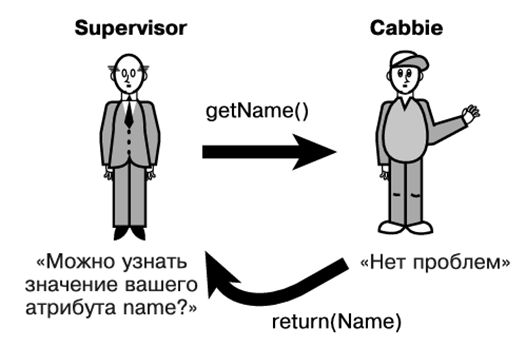
---
## Некоторые принципы ООП, связанные с созданием объектов и их взаимодействием:
1.	Наследование. Позволяет создавать новый класс на основе существующего. Новый класс (наследник) наследует свойства и методы базового класса (родителя), но также может добавлять свои собственные или переопределять унаследованные.
2.	Инкапсуляция. Позволяет скрывать внутренние детали реализации объекта и предоставлять только необходимые интерфейсы для взаимодействия с ним.
3.	Полиморфизм. Позволяет использовать один и тот же интерфейс для разных типов объектов. Это упрощает код и делает его более гибким.
# **40. Руководство по проектированию классов. Проектирование с учетом повторного использования**
Повторное использование кода — одна из ключевых целей объектно-ориентированного проектирования. Хорошо спроектированный класс должен быть:
1)	Универсальным – работать в разных контекстах.
2)	Гибким – допускать расширение без изменения исходного кода.
3)	Изолированным – минимизировать зависимости от других классов.
Объекты могут повторно использоваться в разных системах, а код следует писать с учетом такого повторного использования. Например, когда некий класс Person разработан и протестирован, его можно применять везде, где требуется такой класс. 
Чтобы сделать класс пригодным к использованию в разных системах, его нужно проектировать с учетом повторного использования. Именно здесь потребуется хорошо поразмыслить в процессе проектирования. Попытка предсказать все возможные сценарии, при которых объект Person должен будет работать, — непростая задача. Более того, это фактически невозможно сделать.
Принципы проектирования для повторного использования:
1)	Принцип единственной ответственности (SRP).
2)	Принцип открытости/закрытости (OCP).
3)	Принцип инверсии зависимостей (DIP).
# 41. **Руководство по проектированию классов. Проектирование с учетом расширяемости**
Для того, чтобы расширить класс, а именно добавить в него новые методы, модифицировать другие, необязательно его переписывать. Для этого в дело вступает наследование.
Например, есть класс Person, но нужно принимать во внимание тот факт, что позднее, возможно, потребуется написать класс Employee или Vendor. Поэтому лучше всего сделать так, чтобы Employee наследовал от Person; в этом случае класс Person будет называться расширяемым. Не стоит проектировать класс Person таким образом, чтобы он содержал поведение, которое будет препятствовать его расширяемости другими классами, например, Employee или Vendor (предполагается, что при проектировании разработчик будет нацелен на то, чтобы другие классы расширяли Person). Например, если бы разработчик включил в Employee функциональность, характерную для супервизорных функций, а класс, которому не требуется такая функциональность, наследовал бы от Employee, то у возникла бы проблема.
Необходимо придерживаться абстрагирования. Person должен содержать только данные и поведения, специфичные для него. Другие классы тогда смогут быть его подклассами и наследовать соответствующие данные и поведения.
В соответствии с принципами SOLID классы должны быть расширяемыми, но не модифицируемым. Это означает, что нельзя изменять уже работающий код, нужно расширять его функциональность через наследование, композицию, паттерны.  С применением интерфейсов и их программированием появляется возможность использования любых паттернов, например, декоратора, для расширения возможностей класса без затрагивания проверенного кода, который стал его важной частью.
# **42. Руководство по проектированию классов. Делаем имена описательными**
Следование соглашению об именовании классов, атрибутов и методов является грамотным подходом к проектированию. Существует большое количество соглашений об именовании. Необходимо выбрать одно из них и следовать ему. Однако при выборе соглашения нужно убедится в том, что, разработчик не только следует соответствующему соглашению, но и делает эти имена описательными. Хорошее имя при разработке ПО — это имя осмысленное, описательное, короткое, унифицированное и уникальное. Описательные имена безопасны, удобочитаемы и понятны. Когда кто-нибудь прочтет одно из этих имен, он должен понимать по имени объекта, что тот собой представляет. Какие конкретно соглашения об именовании будут использоваться, в различных организациях зачастую обусловливается стандартами программирования.
Python имеет свои соглашения по именованию, которые описаны в PEP 8 – руководстве по стилю кода Python. Согласно этому руководству:
1)	Классы: PascalCase (Car, ElectricVehicle)
2)	Методы и переменные: snake_case (calculate_speed(), max_speed)
3)	Константы: UPPER_SNAKE_CASE (MAX_ENERGY_LEVEL)
4)	«Приватные» атрибуты: начинаются с _ (_internal_counter)
Именования для Java / C# / C++
1)	Классы: PascalCase (BankAccount, StringBuilder)
2)	Методы и переменные: camelCase (getBalance(), transactionCount)
3)	Константы: UPPER_SNAKE_CASE (MAX_CONNECTIONS)
4)	Приватные поля: иногда с префикса _ или m_ (_balance, m_balance)
# **43. Руководство по проектированию классов. Абстрагирование непереносимого кода**
Непереносимый (нативный) код – это код, который будет выполняться только на определённой аппаратной платформе. При проектировании системы с непереносимым кодом необходимо абстрагировать его от соответствующего класса. Под абстрагированием подразумевается изоляция непереносимого кода в его собственном классе или по крайней мере в его собственном методе (который может быть переопределен).
Например, если разработчик пишет код для доступа к последовательному порту определенного аппаратного обеспечения, то ему следует создать класс-обертку для работы с ним. Собственный класс разработчика (например, class A) затем должен будет отправить сообщение классу-обертке для получения информации и услуг, которые ему нужны. Не стоит размещать зависимый от системы код в своём первичном классе (class A).
--- 
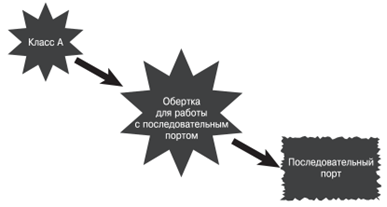
---
Рассмотрим, например, ситуацию, когда программист взаимодействует непосредственно с аппаратным обеспечением. В таких случаях объектный код разных платформ, скорее всего, будет сильно отличаться, поэтому код потребуется написать для каждой платформы. Однако если функциональность будет заключена в класс-обертку, то пользователь класса сможет взаимодействовать непосредственно с оберткой и ему не придется беспокоиться о различном низкоуровневом коде. 
Класс-обертка разберется в различиях платформ и решит, какой код вызывать.
# **44. Руководство по проектированию классов. Обеспечение возможности осуществлять копирование и сравнение**
Разработчику необходимо убедиться в том, что его класс ведёт себя так, как от него ожидается, а это означает, что ему придётся потратить некоторое время на проектирование способов копирования и сравнения объектов.
Некоторые самые простые операции в программировании усложняются, когда дело касается комплексных структур данных и объектов. Например, если потребуется скопировать или сравнить примитивные типы данных, то соответствующий процесс будет довольно простым. Однако копирование и сравнение объектов окажется уже не настолько простым.
Проблема с комплексными структурами данных и объектами состоит в том, что они могут содержать ссылки. Просто скопировав ссылку, вы не скопируете структуры данных или объект, к которому она ведет. В том же духе при сравнении объектов, просто сопоставив один указатель с другим, вы сравните только ссылки, а не то, на что они указывают.
Поскольку объекты могут содержать ссылки, потребуется придерживаться соответствующих деревьев ссылок для того, чтобы выполнить правильное копирование. 
## Глубокое и поверхностное копирование
При глубоком копировании (Deep copy) происходит прохождение по всем ссылкам, а новые копии создаются для всех объектов, на которые имеются ссылки. В глубокое копирование может вовлекаться много уровней. Например, если есть объекты со ссылками на множество объектов, которые, в свою очередь, тоже ссылаются на множество других объектов, то сама копия может требовать значительных «накладных расходов». При поверхностном копировании просто будет сделана копия ссылки без следования уровням. То есть, техника поверхностного копирования (Shallow copy) позволяет нам копировать значения простого объекта в новый объект, не включая внутренние значения объекта. 
### Что следует помнить о поверхностном копировании:
1)	Поверхностное копирование создает новый объект, но использует общие ссылки на внутренние объекты с исходным объектом.
2)	Скопированные и исходные объекты относятся к одним и тем же объектам в памяти.
3)	Изменения, внесенные во внутренние объекты посредством одной ссылки, будут отражены как в скопированных, так и в исходных объектах.
4)	Мелкое копирование — простой и эффективный процесс.
5)	Java предоставляет реализацию мелкого копирования по умолчанию через метод clone().
### Что следует помнить о глубоком копировании:
1)	Глубокое копирование создает новый объект, а также новые копии его внутренних объектов.
2)	Скопированные и исходные объекты имеют независимые копии внутренних объектов.
3)	Изменения, внесенные во внутренние объекты по одной ссылке, не повлияют на другую.
4)	Глубокое копирование — более сложный процесс, особенно при работе с графами объектов или вложенными ссылками.
5)	Глубокое копирование должно быть реализовано явно, либо вручную, либо с использованием библиотек или фреймворков.
## Сравнение объектов в Java
Объекты в Java можно сравнивать как по ссылке, так и по значению.
### Сравнение ссылок.
Если две переменные указывают на один и тот же объект в памяти, то ссылки, которые хранятся в этих переменных равны. Если сравнить такие переменные с помощью оператора равенства ==, получится true.
Integer a = 5;
Integer b = a;
System.out.println(a == b); // true
### Сравнение по значению. 
Однако часто можно встретить ситуацию, когда две переменные ссылаются на два разных, но идентичных объекта. Например, две строки, которые содержат одинаковый текст, но находятся в различных объектах.
Для определения идентичности разных объектов нужно использовать метод equals() Пример:
```java
String a = new String("Привет");
String b = new String("Привет");
System.out.println(a == b); // false
System.out.println(a.equals(b)); // true
```
# **45. Руководство по проектированию классов. Сведение области видимости к минимуму**
Сведение области видимости к минимуму идет рука об руку с абстрагированием и сокрытием реализации. Идея заключается в ограничении доступа к переменным, функциям и другим ресурсам только теми частями кода, которым они действительно необходимы. Это делается для повышения безопасности и упрощения понимания кода, так как уменьшает вероятность случайного изменения или использования не предназначенных для этого ресурсов. Таким образом, сопровождать, тестировать и расширять классы станет намного легче. Применение интерфейсов хорошо помогает это обеспечить.
**Минимизация области видимости глобальных переменных** — хороший стиль программирования, но она характерна не только для объектно-ориентированного программирования. При структурной разработке допускается использование глобальных переменных, однако это рискованно. Фактически в сфере объектно-орентированной разработки нет глобальных данных. Статические атрибуты и методы совместно используются объектами одного и того же класса, однако они недоступны остальным объектам. Общий доступ к данным можно обеспечить через файл или базу данных.
Например, если у вас имеется метод, которому требуется временный атрибут, пусть он будет локальным. Взгляните на приведенный далее код:
```cs
 public class Math {
    int temp=0;
    public int swap (int a, int b) {
        temp = a;
        a=b;
        b=temp;
        return temp;
    }
 }
```
Проблема заключается в том, что необходимо, чтобы атрибут temp был только в рамках области видимости метода swap(). Нет никаких причин для того, чтобы он был на уровне класса. Таким образом, следует переместить temp в область видимости метода swap():
```cs
 public class Math {
    public int swap (int a, int b) {
      int temp=0;
      temp = a;
      a=b;
      b=temp;
      return temp;
    }
 }
```
 Вот что подразумевается под сведением области видимости к минимуму
# **46. Руководство по проектированию классов. Проектирование с учетом сопровождаемости**
Проектирование практичных и компактных классов обеспечивает высокий уровень сопровождаемости.  Классы следует проектировать с учетом будущего сопровождения.
Процесс проектирования классов вынуждает разделять код на множество идеально управляемых фрагментов. Отдельные фрагменты кода гораздо удобнее в сопровождении, чем его более крупные фрагменты. Один из наилучших способов обеспечить сопровождаемость — уменьшить количество взаимозависимого кода, то есть изменения в одном классе не должны сказываться, даже минимально, на других классах.
## Тесно связанные классы 
Классы, которые сильно зависят друг от друга, считаются тесно связанными. Таким образом, если изменение, внесенное в один класс, приводит к изменению в другом классе, то эти два класса будут считаться тесно связанными. Классы, лишенные таких зависимостей, обладают очень низкой степенью связанности.
Если классы изначально правильно спроектированы, то любые изменения в системе должны вноситься только в реализацию объекта. Изменений открытого интерфейса следует избегать любой ценой. Любые изменения открытого интерфейса приведут к волновым эффектам во всех системах, задействующих этот интерфейс.
Например, если внести изменение в метод getName() класса Cabbie, то все места во всех системах, где используется этот интерфейс, потребуется изменить и перекомпилировать. Обнаружение всех соответствующих вызовов методов — это грандиозная задача, а вероятность упустить один из них довольно высока.
Для обеспечения высокого уровня сопровождаемости нужно делать так, чтобы степень связанности классов была как можно ниже.
# **47. Руководство по проектированию классов. Использование итерации в процессе разработки**
Как и в большинстве функций проектирования и программирования, рекомендуется использовать итеративный процесс. Это хорошо согласуется с концепцией обеспечения минимальных интерфейсов. 
Концепция минимальных интерфейсов относится к принципу разделения интерфейсов (Interface Segregation Principle), одному из пяти принципов SOLID. Она предполагает, что интерфейсы должны быть максимально небольшими и специализированными, не перегруженными ненужными методами.
Использование итерации в процессе разработки по сути означает, что не нужно писать сразу весь код! Это нужно делать небольшими шагами, создавая и тестируя код на каждом этапе. Хороший план тестирования позволит быстро выявить все области, где обеспечены недостаточные интерфейсы. Таким образом, процесс можно будет повторять до тех пор, пока у класса не появятся надлежащие интерфейсы. Этот процесс тестирования затрагивает не только написанный код. Очень полезно протестировать то, что было спроектировано, с применением критического анализа и других методик оценки результатов. Использование итеративных процессов облегчает жизнь тестировщикам, поскольку они вовлекаются в ход событий еще на раннем этапе, а не просто получают в свои руки систему, которую им «перебрасывают через стену» в конце процесса разработки.
# **48. Руководство по проектированию классов. Тестирование интерфейса**
Минимальные реализации интерфейса часто называются заглушками.
Используя заглушки, можно тестировать интерфейсы без написания реального кода. В приведенном далее примере вместо подключения к настоящей базе данных заглушки применяются для проверки того, что интерфейсы работают правильно (с точки зрения пользователя, ведь интерфейсы предназначены для них). Таким образом, на данном этапе нет необходимости в реализации. Более того, обеспечение завершенной реализации на данном этапе может стоить драгоценного времени и сил, поскольку конструкция интерфейса повлияет на реализацию, а интерфейс при этом еще не будет завершен.
Вот пример кода, который задействует внутренний массив для имитации работающей базы данных:
```cs
 public class DataBaseReader {
   private String db[] = { "Record1","Record2","Record3","Record4", 
   "Record5"};
   private booleanDBOpen = false;
   private int pos;
   public void open(String Name){
       DBOpen = true;
   }
   public void close(){
      DBOpen = false; 
   }
   public void goToFirst(){
      pos = 0;
   public void goToLast(){
      pos = 4;
   }
public int howManyRecords(){
      int numOfRecords = 5;
      return numOfRecords;
   }
         public String getRecord(int key){
               /* DB Specific Implementation */
       return db[key];
   }
 public String getNextRecord(){
      /* DB Specific Implementation */
      return db[pos++];
    }
```
## Сохранение заглушек
Когда заглушки закончат своё дело, не обязательно их удалять. Лучше всего сохранить их в коде, то есть, встроить функциональность для тестирования прямо в класс. При этом нужно сделать так, чтобы пользователи этих заглушек не видели, а программисты, напротив, знали о них. Возможно более подходящей практикой может оказаться создание заглушек с мок-данными, встроенными в интерфейсы, тогда в случае надобности их можно будет убрать из самой реализации.
Сталкиваясь с проблемами при проектировании интерфейсов, нужно вносить изменения и повторять процесс до тех пор, пока результат не будет устраивать.

# **49. Руководство по проектированию классов. Использование постоянства объектов**
## Руководство по проектированию классов
Одна из основных целей объектно-ориентированного программирования — моделирование реальных систем способами, которые схожи с фактическим образом мышления людей. Проектирование классов — это объектно-ориентированный вариант создания таких моделей. Вместо использования структурного, или нисходящего, подхода, при котором данные и поведения — это логически раздельные сущности, объектно-ориентированный подход инкапсулирует данные и поведения в объектах, взаимодействующих друг с другом.
Постоянство объектов — еще один вопрос, который требуется решать во многих объектно-ориентированных системах. Постоянство — это концепция сохранения состояния объекта. Если вы не сохраните объект тем или иным путем при выполнении программы, то он «умрет» и его нельзя будет «воскресить» когда либо. Такие временные объекты могут работать в некоторых приложениях, однако в большинстве бизнес-систем состояние объекта должно сохраняться для последующего использования
В своей простейшей форме объект может сохраняться, будучи сериализованным и записанным в простой файл. Самая современная технология сейчас базируется на XML. Теоретически объект может сохраняться в памяти, пока не будет уничтожен, но мы сосредоточимся на сохранении постоянных объектов на чем то вроде запоминающего устройства. Следует учитывать три типа первичных «запоминающих устройств».
*	Система простых файлов — вы можете сохранить объект в простом файле, сериализовав его. Это определенно устаревший способ. Гораздо чаще объекты сериализуют в файлы XML и/или JSON и записывают в подобие файловой системы, массива данных или конечного устройства.
*	Реляционная база данных — для преобразования объекта в реляционную модель потребуется некоторое промежуточное программное обеспечение.
Реляционная база данных - это система хранения и организации данных, основанная на реляционной модели. В реляционной модели данные представляются в виде таблиц (отношений), где каждая строка таблицы представляет собой отдельную запись, а столбцы представляют собой атрибуты этой записи. 
*	Объектно-ориентированная база данных — может оказаться наиболее эффективным способом сделать объекты постоянными, однако вся информация большинства компаний содержится в унаследованных системах, и на данный момент маловероятно, что они решат преобразовать свои реляционные базы данных в объектно-ориентированные. Это наиболее распространенный тип баз данных с гибкой структурой. Самые известные — это MongoDB и Cosmos DB.
# **50. Руководство по проектированию классов. Сериализация и маршалинг объектов**
Для передачи объекта по сети (например, файлу) система должна деконструировать этот объект (сделать его простым), передать его по сети, а затем реконструировать на другом конце сети. Этот процесс называется сериализацией объекта. Действие по передаче объекта по сети называется маршалингом объекта. В теории сериализованный объект может быть записан в простой файл и извлечен позднее в том же состоянии, в каком был записан.
Основной вопрос здесь состоит в том, что при сериализации и десериализации должны использоваться одни и те же спецификации. Это что-то вроде алгоритма шифрования. Если один объект зашифрует строку, то другому объекту, который захочет расшифровать ее, придется использовать тот же алгоритм шифрования. В Java предусмотрен интерфейс Serializable, который обеспечивает соответствующее преобразование. 
Это еще одна причина, почему в наши дни данные отделены от поведений. Гораздо проще создать интерфейс для контракта данных и разместить его на веб сервисе, чем убедиться в том, что у обеих сторон одинаковый код.
# **51. Руководство по проектированию с использованием объектов. Проведение соответствующего анализа. Составление технического задания. Сбор требований. Разработка прототипа интерфейса пользователя**
## Руководство по проектированию с использованием объектов.
Как правило, надлежащий процесс объектно-ориентированного проектирования включает следующие этапы. 
1.	Проведение соответствующего анализа. 
2.	Составление технического задания, описывающего систему. 
3.	Сбор требований исходя из составленного технического задания. 
4.	Разработка прототипа интерфейса пользователя. 
5.	Определение классов. 
6.	Определение ответственности каждого класса. 
7.	Определение того, как разные классы будут взаимодействовать друг с другом. 
8.	Создание высокоуровневой модели, описывающей систему, которую требуется построить
## Проведение соответствующего анализа.
На стадии анализа пользователям и разработчикам необходимо провести соответствующее исследование и анализ, чтобы определить техническое задание, требования к проекту и понять, следует ли вообще заниматься этим проектом. Последний пункт может показаться немного неожиданным, однако он важен. На стадии анализа нужно без всяких колебаний прекратить работу над проектом, если выяснится, что на то есть веская причина.	
## Составление технического задания
Техническое задание — документ, описывающий систему. Хотя определение требований — это конечная цель стадии анализа, на данном этапе они еще не обретают свою финальную форму. Техническое задание должно обеспечить полное понимание системы для любого человека, прочитавшего этот документ. Независимо от того, как оно будет составлено, техническое задание должно представлять полную систему и ясно описывать то, как система будет выглядеть. Техническое задание должно содержать следующие разделы:
*	введение;
*	основания для разработки;
*	назначение разработки;
*	требования к программе или программному изделию;
*	требования к программной документации;
*	технико-экономические показатели;
*	стадии и этапы разработки;
*	порядок контроля и приемки;
*	в техническое задание допускается включать приложения.
---
В зависимости от особенностей программы или программного изделия допускается уточнять содержание разделов, вводить новые разделы или объединять отдельные из них.
## Сбор требований
Документ с требованиями описывает, что, по мнению пользователей, должна делать система. Необязательно излагать требования на высоком техническом уровне, но они должны быть достаточно конкретными для того, чтобы можно было понимать потребности пользователя в конечном продукте.
| Тип                     | Описание                                      | Пример |
|-------------------------|-----------------------------------------------|--------|
| **Бизнес-требования**   | Высокоуровневые цели организации              | Увеличение продаж на 15%, снижение времени обработки заказа |
| **Пользовательские требования** | Что пользователь хочет получить от системы | Возможность быстрого поиска товаров, удобный интерфейс |
| **Функциональные требования** | Конкретные действия системы           | Система должна отправлять уведомления при новых заказах |
| **Нефункциональные требования** | Качественные характеристики системы | Время отклика не более 2 секунд, поддержка 1000+ одновременных подключений |

## Разработка прототипа интерфейса пользователя  
Разработка прототипа интерфейса пользователя (UI) для программного обеспечения - это создание упрощенной, интерактивной модели пользовательского интерфейса, которая позволяет тестировать основные функции и взаимодействие с пользователем до начала разработки полной версии программного обеспечения
---
# **52. Проектирование с использованием объектов. Определение классов. Определение ответственности каждого класса. Определение взаимодействия классов друг с другом. Создание модели классов для описания системы.**
## Определение классов
После того как требования будут задокументированы, вы сможете начать процесс определения классов. Если брать за основу требования, то самый простой способ определить классы — выделить все существительные. Они представляют людей, места и вещи. Не слишком беспокойтесь насчет того, чтобы определить сразу все классы. Может получиться так, что вам придется удалять, добавлять и изменять классы на разных стадиях всего процесса проектирования. Проектирование является итеративным процессом
## Определение ответственности каждого класса
Вам потребуется определить ответственность каждого созданного ранее класса. Сюда входят данные, которые должен содержать класс, а также операции, которые он должен выполнять. Например, объект Employee отвечает за расчет заработной платы и перевод денег на соответствующий счет. Он также может отвечать за хранение таких данных, как разные уровни оплаты труда и номера счетов в различных банках.
## Определение взаимодействия классов друг с другом
Большинство классов не существуют в изоляции. Хотя класс должен нести определенную ответственность, ему неоднократно придется взаимодействовать с другими классами, чтобы получить требуемое. Именно здесь находят свое применение сообщения между классами. Один класс может отправить сообщение другому, когда ему нужна информация из этого класса либо требуется, чтобы другой класс что-то сделал для него
## Создание модели классов для описания системы
Когда все классы, их ответственность и взаимодействия будут определены, вы сможете приступить к конструированию модели классов, представляющей полную систему. Модель классов показывает, как разные классы взаимодействуют в рамках системы.
# **53. Проектирование с использованием объектов. Объектные обертки. Структурированный код. Обертывание структурированного кода. Обертывание непереносимого кода. Обертывание существующих классов.**
## Объектные обертки
**Объектные обертки (wrappers)** — это классы, которые инкапсулируют сторонний или устаревший код, преобразуя его интерфейс к удобному для текущей системы виду.
## Структурированный код
В качестве базовых концепций структурного программирования указываются последовательность, условия и итерации.
Последовательность является базовой концепцией потому, что представляется логичным начинать сверху и следовать вниз. Суть структурного программирования заключается в условиях и итерациях, операторах if и циклах
Взгляните на приведенный далее Java-код, который начинает с 0 и выполняет цикл десять раз, выводя значение, если оно равняется 5: 
```java
class MainApplication 
{ 
public static void main(String args[]) 
{ 
int x = 0; 
while (x <= 10) 
{ 
if (x==5) System.out.println("x = " + x);
 x++; 
} 
} 
}
```

## Обертывание структурированного кода 
Как вы можете видеть, объект содержит методы, а они, в свою очередь, включают код, который может быть любым, начиная с объявлений переменных и заканчивая условиями и циклами.
Рассмотрим простой пример, в котором мы осуществим обертывание функциональности, обеспечивающей сложение. В данном случае мы создадим метод с именем add, который примет два целочисленных параметра и возвратит их сумму
```java
class SomeMath 
{ 

public int add(int a, int b) 
{ 
return a + b; 
} 
}
```
Как вы можете видеть, структурированный код, используемый для выполнения сложения (a+b), обернут в метод add.
## Обертывание непереносимого кода
Объектные обертки также могут использоваться для сокрытия непереносимого (или нативного) кода. Концепция, в принципе, будет аналогичной, однако в данном случае суть заключается в том, чтобы взять код, выполнение которого возможно только на одной платформе (или немногих платформах), и инкапсулировать его в методе с обеспечением простого интерфейса для программистов, которые будут использовать этот код
Возьмем, к примеру, задачу подачи сигнала. На платформе Windows мы можем обеспечить подачу сигнала с помощью приведенного далее кода:
```java
 System.out.println("\007"); 
``` 
Вместо того чтобы вынуждать программистов запоминать код (или искать его), вы можете предусмотреть класс с именем Sound, содержащий метод beep, как показано далее: 
```java
class Sound 
{ 
public void beep() 
{ 
System.out.println("\007"); 
} 
}
```
Так программистам будет проще работать. Кроме того, вы сможете расширить функциональность класса, включив в него другие методы для генерирования сигналов. Пожалуй, более важно то, что при работе кода на платформе, не являющейся Windows, интерфейс для пользователей останется прежним. Коротко говоря, команде, которая будет создавать код для класса Sound, придется иметь дело с изменением платформы. Для программистов, использующих этот класс в своих приложениях, изменение не создаст никаких проблем, поскольку они по-прежнему смогут вызывать метод beep.
## Обертывание существующих классов
Хотя необходимость обертывать унаследованный структурированный или даже непереносимый код в тот или иной новый класс может показаться резонной, необходимость обертывать существующие классы уже не настолько очевидна. Кроме того, есть много причин для того, чтобы создавать обертки для существующих классов
Разработчики программного обеспечения часто применяют код, написанный кем-то другим. Во многих случаях оказывается, что код нельзя изменить. Именно в таких ситуациях проявляется истинная мощь оберток.
Идея заключается в том, чтобы взять существующий класс и изменить его реализацию или интерфейс, обернув его в новый класс
# **54.	Наследование и композиция. Повторное использование объектов**
Наследование, как видно из его названия, подразумевает получение по наследству атрибутов и поведений от других классов. При этом имеет место настоящее отношение «родительский класс / дочерний класс». Дочерний класс (или подкласс) наследует напрямую от родительского класса (или суперкласса)
Композиция, как тоже видно из названия, подразумевает создание объектов с использованием других объектов.
## Повторное использование объектов
Пожалуй, главная причина существования наследования и композиции - повторное использование объектов. Коротко говоря, вы можете создавать классы (которые в конечном счете станут объектами), применяя другие классы посредством наследования и композиции. Ведь эти механизмы фактически являются единственными способами повторного использования ранее созданных классов. 
Наследование представляет отношение «является экземпляром»
Композиция подразумевает использование других классов для создания более сложных классов, то есть для осуществления своего рода сборки. При этом нет никаких отношений «родительский класс / дочерний класс». По сути, сложные объекты состоят из других объектов. Композиция представляет отношение «содержит как часть». Например, автомобиль содержит как часть двигатель. Двигатель и автомобиль — отдельные, потенциально самостоятельные объекты. Однако автомобиль является сложным объектом, который включает в себя (содержит как часть) такой объект, как двигатель.
# **55. Наследование и композиция. Наследование. Обобщение и конкретизация. Проектные решения** 
## Наследование
Наследование было определено как система, при которой дочерние классы наследуют атрибуты и поведения от родительского класса.
Отношение наследования можно определить, придерживаясь простого правила: если вы можете сказать, что класс B является экземпляром класса А, то это отношение — хороший кандидат на то, чтобы быть от ношением наследования.
Взглянем на класс Dog. В примере укажем два поведения для Dog: bark и pant. Таким образом, мы сможем создать класс Dog, содержащий два поведения наряду с двумя атрибутами
 
Теперь предположим, что нам потребовалось создать класс GoldenRetriever. Можно создать совершенно новый класс, содержащий те же поведения, которые имеются в классе Dog. При этом можно будет сделать следующий вполне обо снованный вывод: GoldenRetriever является экземпляром Dog. В силу этого отношения у нас будет возможность наследовать атрибуты и поведения от Dog и использовать их в новом классе GoldenRetriever
 
## Обобщение и конкретизация
 
Взглянем на объектную модель иерархии классов во главе с Dog. Мы начали с одного класса с именем Dog и определили общность между разными породами собак. Эту концепцию, иногда называемую обобщением-конкретизацией, также необходимо принимать во внимание при использовании наследования. Идея заключается в том, что по мере того, как вы спускаетесь по дереву наследования, все становится более конкретным. Самое общее располагается на верхушке дерева наследования. Если рассматривать наше дерево наследования Dog, класс с аналогичным названием располагается на его верхушке и является наиболее общей категорией. Разные породы — классы GoldenRetriever, LhasaApso и Basenji — являются наиболее конкретными. Идея наследования состоит в том, чтобы переходить от общего к частному, выделяя общность.
Проектные решения  
В теории лучший подход — выделение как можно большей общности. Однако, как и во всех задачах проектирования, слишком хорошо тоже нехорошо. Не смотря на то что выделение как можно большей общности может быть максимально приближенным к реальной жизни, оно может не быть максимально приближенным к вашей модели. Чем большую общность вы выделяете, тем сложнее становится ваша система. Таким образом, вам необходимо решить головоломку: вы хотите, чтобы у вас была более точная модель или же менее сложная система? Вам придется сделать выбор в зависимости от вашей ситуации, и нет никаких жестких директив, которым необходимо следовать при принятии этого решения
При проектировании вы будете сталкиваться с ситуациями, когда преимущества более точной модели не будут оправдывать повышение сложности. Предположим, что вы являетесь собаководом и заключили субподрядный договор на создание системы, позволяющей отслеживать всех ваших собак. Системная модель, которая включает собак как лающих, так и издающих звуки, похожие на йодль, отлично работает. Однако, допустим, вы не разводите собак, издающих звуки, похожие на йодль. Пожалуй, у вас не будет необходимости усложнять систему разграничением собак по указанному параметру. Это сделает систему более простой и обеспечит требуемую вам функциональность. 
Решение о том, проектировать все так, чтобы система была менее сложной или же обладала большей функциональностью, должно быть сбалансированным. Основная цель заключается в том, чтобы всегда стремиться создать систему, которая будет гибкой, но не настолько сложной, что может рухнуть под собственной тяжестью.
# **56. Наследование и композиция. Композиция. Почему инкапсуляция является фундаментальной объектно-ориентированной концепцией. Как наследование ослабляет инкапсуляцию**
## Композиция
Композиция подразумевает использование других классов для создания более сложных классов, то есть для осуществления своего рода сборки. При этом нет никаких отношений «родительский класс / дочерний класс». По сути, сложные объекты состоят из других объектов. Композиция представляет отношение «содержит как часть». Например, автомобиль содержит как часть двигатель. Двигатель и автомобиль — отдельные, потенциально самостоятельные объекты. Однако автомобиль является сложным объектом, который включает в себя (содержит как часть) такой объект, как двигатель
 
## Почему инкапсуляция является фундаментальной объектно-ориентированной концепцией
Инкапсуляция — фундаментальная объектно-ориентированная концепция. Основной вопрос заключается в том, что в классе должно быть видно, а что — нет. Инкапсуляция в равной мере касается данных и по ведений. Когда речь идет о классе, то первоочередное проектное решение «вращается» вокруг инкапсуляции как данных, так и поведений в хорошо написан ном классе. Инкапсуляция является настолько фундаментальной объектно-ориентированной концепцией, что представляет собой одно из главных правил ООП.
## Как наследование ослабляет инкапсуляцию  
Инкапсуляция — это процесс упаковки классов в открытый интерфейс и закрытую реализацию. По сути, в классе скрывается все, о чем другим классам знать необязательно.
Наследование означает сильную инкапсуляцию по отношению к остальным классам, но слабую инкапсуляцию между суперклассом и его подклассами
Проблема заключается в том, что если от суперкласса будет унаследована реализация, которая затем подвергнется модификации, то такое изменение распространится по иерархии классов. Этот волновой эффект потенциально способен затронуть все подклассы.
# **57. Наследование и композиция. Подробный пример полиморфизма**  
## Подробный пример полиморфизма
Разработка класса для создания полностью независимых объектов является сутью объектно-ориентированного подхода. В хорошо спроектированной системе объект должен быть способен ответить на все важные вопросы о себе.
полиморфизм буквально означает множественность форм. При отправке сообщения объекту он должен располагать методом, позволяющим ответить на это сообщение. В иерархии наследования все под классы наследуют интерфейсы от своих суперклассов. Однако поскольку каждый подкласс представляет собой отдельную сущность, каждому из них может потребоваться дать отдельный ответ на одно и то же сообщение.
В качестве очень простого примера представьте, что у вас имеется четыре класса: абстрактный класс Shape и конкретные классы Circle, Rectangle и Star. Вот код:
```java
public abstract class Shape{
    public abstract void draw();
 } 
public class Circle extends Shape{
    public void draw() {
        System.out.println("Я рисую круг");
    }
 }
 public class Rectangle extends Shape{
    public void draw() {
        System.out.println("Я рисую прямоугольник");
  }
 }
 public class Star extends Shape{
    public void draw() {
        System.out.println("Я рисую звезду");
    }
 }
```
Чтобы увидеть истинную мощь полиморфизма, вы можете передать объект Shape методу, который абсолютно не имеет понятия, какую фигуру предстоит нарисовать.
```java
public class TestShape {
    public static void main(String args[]) {
      Circle circle = new Circle();
      Rectangle rectangle = new Rectangle();
      Star star = new Star();
      drawMe(circle);
      drawMe(rectangle);
      drawMe(star);
    }
    static void drawMe(Shape s) {
      s.draw();
    }
 }
```
# **58. Наследование и композиция. Ответственность объектов**  
Смысл полиморфизма заключается в том, что вы можете отправлять сообщения разным объектам, которые будут отвечать на них в соответствии со своими объектными типами. 
Например, если вы отправите сообщение getArea() классу Circle, то это приведет к вычислению с использованием формулы, отличной от той, которая будет применена, если отправить аналогичное сообщение getArea() классу Rectangle. Это потому, что Circle и Rectangle отвечают каждый за себя. Если вы попросите Circle возвратить значение площади круга, то он будет знать, как это сделать. 
Если вы захотите, чтобы Circle нарисовал круг, то он сможет сделать и это. Объект Shape не смог бы сделать этого, даже если бы можно было создать его экземпляр, поскольку у него нет достаточного количества информации о себе.
```java
public abstract class Shape{
    public abstract void draw();
 } 
public class Circle extends Shape{
    public void draw() {
        System.out.println("Я рисую круг");
    }
 }
 public class Rectangle extends Shape{
    public void draw() {
        System.out.println("Я рисую прямоугольник");
  }
 }
 public class Star extends Shape{
    public void draw() {
        System.out.println("Я рисую звезду");
    }
 }
```
Для каждого класса есть только один метод — draw(). Вот что важно для полиморфизма и объектов, которые отвечают за себя: конкретные классы сами несут ответственность за функцию рисования. Класс Shape не обеспечивает код для осуществления рисования; классы Circle, Rectangle и Star делают это сами.
# **59. Наследование и композиция. Абстрактные классы, виртуальные методы и протоколы** 
Абстрактные классы определяют интерфейс, но не реализуют его, требуя от производных классов предоставить конкретную реализацию. Виртуальные методы позволяют переопределять поведение в производных классах. Протоколы, в свою очередь, определяют набор методов, которые должны быть реализованы классом, чтобы соответствовать определенному интерфейсу.
```java
public abstract class Shape{
   public abstract void draw();
 }
```
Код, написанный на Visual Basic .NET, выглядит так:
```vb
 Public MustInherit Class Shape
     Public MustOverride Function draw()
 End Class
```
Аналогичная функциональность может быть обеспечена на C++ с использованием виртуальных методов, а код будет выглядеть следующим образом:
```cpp
 class Shape
 {
    public:
        virtual void draw() = 0;
 }
```
Например, взгляните на приведенный далее код Java-интерфейса для класса 
Shape:
```java
 public abstract class Shape{
    public abstract void draw();
 }
```
Соответствующий протокол Objective-C (Swift) показан в следующем коде. Обратите внимание, что в коде, написанном как на Java, так и на Objective-C, нет реализации для метода draw():
```objc
 @protocol Shape
 @required- (void) draw;
 @end // Shape
```
Коротко говоря, подклассы не могут напрямую наследовать какой либо код от протокола, поэтому протокол нельзя использовать тем же образом, что и абстрактный класс, а это имеет значение при проектировании объектной модели.
# **60. Фреймворки и повторное использование: проектирование с применением интерфейсов и абстрактных классов**
**Фреймворк** — это набор готовых библиотек, инструментов, шаблонов и правил, которые предоставляют основу для разработки программного обеспечения. Фреймворк определяет архитектурный каркас приложения и предоставляет стандартные механизмы для реализации часто встречающихся задач.
**Повторное использование кода (code reuse)** — это практика использования существующего кода в новых проектах вместо написания его заново. Это позволяет экономить время, уменьшает количество ошибок и способствует унификации решений.
**Интерфейсы и абстрактные классы** — это ключевые инструменты объектно-ориентированного проектирования, которые позволяют создавать гибкие, расширяемые и легко тестируемые системы. Они помогают абстрагироваться от конкретной реализации и работать с поведением на уровне абстракции.
**Интерфейс** — это контракт, который определяет, какие методы должен реализовать класс, но не указывает, как именно они будут реализованы. Интерфейс описывает что , а не как .
**Абстрактный класс** — это класс, который может содержать как абстрактные методы (без реализации), так и частичную или полную реализацию некоторых методов. Он служит шаблоном для других классов и не может быть создан напрямую .
# **61.	Фреймворки и повторное использование: проектирование с применением интерфейсов и абстрактных классов. Код: использовать повторно или нет?**
## Код: использовать повторно или нет?
Как и в случае со всеми подходами к проектированию, полезность кода, а также его пригодность к повторному использованию зависят от того, насколько хорошо он был спроектирован и реализован.
Нет ничего, что мешает кому-либо написать очень надежный и пригодный для повторного использования код на том или ином языке программирования, который не является объектно-ориентированным.
Объектно-ориентированный подход предусматривает несколько механизмов, облегчающих разработку такого кода. Один из способов создания пригодного для повторного использования кода заключается в создании фреймворков.
# **62. Фреймворки и повторное использование: проектирование с применением интерфейсов и абстрактных классов. Что такое фреймворк?**  
Фреймворки основаны на принципах повторного использования кода и стандартизации , обеспечивая единообразие интерфейсов и функциональности. Это позволяет как разработчикам эффективно использовать уже готовые и протестированные компоненты (например, окна, меню, диалоговые элементы), так и пользователям — легко осваивать различные приложения благодаря одинаковому внешнему виду и поведению.
### Пример: 
офисные приложения (текстовый редактор, таблицы, презентации) используют общий фреймворк — у них одинаковые вкладки, меню и интерфейсные элементы, что упрощает использование и разработку.
---
Фреймворки предоставляют стандартный API (интерфейс программирования приложений), следуя которому, разработчики могут создавать совместимые и стабильные приложения без необходимости изобретать всё с нуля.
### Ключевые идеи:
*	Фреймворк — это набор готовых компонентов и правил их использования.
*	Он реализует концепцию «включил и работай» (plug and play).
*	Обеспечивает стандартизацию интерфейса и повторное использование кода.
*	Упрощает работу разработчикам и делает программы интуитивно понятными для пользователей.
*	Использование фреймворка требует соблюдения его API, который документирован и тестируется заранее
# **63.	Фреймворки и повторное использование: проектирование с применением интерфейсов и абстрактных классов. Что такое контракт?**  
## Что такое контракт?  
Контракт как любой механизм, требующий от разработчиков соблюдения спецификаций того или иного API интерфейса. Часто бывает так, что API-интерфейс называют фреймворком
При использовании контрактов разработчик обязан соблюдать правила, определенные для фреймворка. Сюда входят имена методов, количество параметров и т. д.
Принудительное следование требуемым нормам жизненно важно, поскольку всегда существует вероятность того, что разработчик нарушит контракт.
При использовании таких языков программирования, как Java и .NET, два способа реализации контрактов заключаются в применении абстрактных классов и интерфейсов соответственно.
# **64.	Фреймворки и повторное использование: проектирование с применением интерфейсов и абстрактных классов. Абстрактные классы** 
Абстрактные классы используются для реализации контрактов в объектно-ориентированном программировании. Они определяют методы без реализации (абстрактные методы), которые обязательно должны быть реализованы в дочерних классах.
Пример: абстрактный класс Shape может содержать абстрактный метод draw(). Классы Circle и Rectangle, наследующиеся от Shape, обязаны реализовать этот метод по-своему — рисовать круг или прямоугольник. Это позволяет вызывать один и тот же метод draw() для разных фигур, получая разный результат — это и есть полиморфизм .
## Основные идеи:
*	Абстрактный класс — это класс с хотя бы одним абстрактным методом. Он не может быть инстанциирован напрямую.
*	Контракт между классами означает, что все подклассы обязаны реализовать определённые методы.
*	Абстрактные классы поддерживают повторное использование кода и обеспечивают единый интерфейс .
*	Помимо абстрактных методов, абстрактный класс может содержать обычные (конкретные) методы, которые наследуются всеми подклассами.
*	В некоторых языках вместо абстрактных классов для реализации контрактов используются интерфейсы или протоколы (например, в Swift и Objective-C).
```java
public abstract class Shape {
    public abstract void draw(); // абстрактный метод
}

public class Circle extends Shape {
    public void draw() {
        System.out.println("Рисование круга");
    }
}

public class Rectangle extends Shape {
    public void draw() {
        System.out.println("Рисование прямоугольника");
    }
}
```
# **65.	Фреймворки и повторное использование: проектирование с применением интерфейсов и абстрактных классов. Интерфейсы**
Интерфейсы — это инструмент определения контрактов , согласно которым классы обязаны реализовать определённые методы. Они похожи на абстрактные классы, но не содержат никакой реализации .
Основные идеи:
	В C++ интерфейсов как отдельной конструкции нет, но их можно имитировать с помощью абстрактных классов , содержащих только чисто виртуальные методы.
	В Java, .NET, Objective-C и Swift существуют собственные конструкции для контрактов:
	Интерфейсы (Java, .NET),
	Протоколы (Objective-C, Swift).
	В отличие от абстрактных классов, интерфейсы позволяют обходить ограничение одиночного наследования , так как класс может реализовывать несколько интерфейсов .
	Это делает интерфейсы удобным средством для множественного наследования поведения без сложностей полноценного множественного наследования классов.
Пример интерфейса (на Java)
public interface Nameable {
    String getName();
    void setName(String aName);
}
Пример протокола (на Objective-C):
@protocol Nameable
- (char *)getName;
- (void)setName:(char *)n;
@end


# 66. **Фреймворки и повторное использование: проектирование с применением интерфейсов и абстрактных классов. Код, выдерживающий проверку компилятором**
Фреймворк — это набор готовых библиотек, инструментов, шаблонов и правил, которые предоставляют основу для разработки программного обеспечения. Фреймворк определяет архитектурный каркас приложения и предоставляет стандартные механизмы для реализации часто встречающихся задач.
### Примеры:
* Django, Flask (Python)
* Spring (Java)
* React, Angular (JavaScript/TypeScript)
* .NET (C#)
Повторное использование кода (code reuse) — это практика использования существующего кода в новых проектах вместо написания его заново. Это позволяет экономить время, уменьшает количество ошибок и способствует унификации решений.
### **Как фреймворки способствуют повторному использованию?**
*	Готовые функциональные модули. Фреймворки предоставляют уже протестированные и отлаженные модули (например, маршрутизация, аутентификация, ORM), которые можно использовать повторно в разных проектах.
*	Стандартизация структуры проекта. Благодаря четкой структуре (например, MVC в Spring или Django), разработчики могут легко переносить знания и решения из одного проекта в другой.
*	Шаблоны проектирования. Многие фреймворки используют популярные паттерны проектирования (Singleton, Factory, Observer и др.), что делает их применение в проектах повторяемым и предсказуемым.
*	Расширяемость. Фреймворки позволяют создавать собственные модули и компоненты, которые также можно использовать в других проектах на том же фреймворке.
*	Унификация API. Единый интерфейс взаимодействия с фреймворком упрощает повторное использование кода в разных частях системы или даже в других системах.
*	Снижение зависимости от конкретной реализации. Использование фреймворков абстрагирует разработчика от деталей реализации базовых функциий, что упрощает замену или переиспользование компонентов.
Допустим, вы используете фреймворк Django для создания веб-приложений:
*	Вы можете повторно использовать механизм аутентификации , не пиша его каждый раз заново.
*	Вы можете использовать ORM для работы с базами данных в любом проекте.
*	Можно создать пользовательские шаблоны или вьюхи (views) и использовать их в других проектах на Django.
Интерфейсы и абстрактные классы — это ключевые инструменты объектно-ориентированного проектирования, которые позволяют создавать гибкие, расширяемые и легко тестируемые системы. Они помогают абстрагироваться от конкретной реализации и работать с поведением на уровне абстракции.
Интерфейс — это контракт, который определяет, какие методы должен реализовать класс, но не указывает, как именно они будут реализованы. Интерфейс описывает что , а не как .

### **Пример (на Python):**
```PYTHON
from abc import ABC, abstractmethod
class PaymentMethod(ABC):
    @abstractmethod
    def pay(self, amount: float):
        pass
#Классы, реализующие этот интерфейс, должны предоставить свою собственную реализацию метода pay():
class CreditCardPayment(PaymentMethod):
    def pay(self, amount: float):
        print(f"Оплата по кредитной карте: {amount} руб.")
class PayPalPayment(PaymentMethod):
    def pay(self, amount: float):
        print(f"Оплата через PayPal: {amount} руб.")
```
Теперь можно писать код, который работает с PaymentMethod, не зная, какая именно реализация используется.
**Абстрактный класс** — это класс, который может содержать как абстрактные методы (без реализации), так и частичную или полную реализацию некоторых методов. Он служит шаблоном для других классов и не может быть создан напрямую .
### **Пример:**
```PY
from abc import ABC, abstractmethod
class Vehicle(ABC):
    def start_engine(self):
        print("Двигатель запущен")
    @abstractmethod
    def move(self):
        pass
#Реализация в подклассах:
class Car(Vehicle):
    def move(self):
        print("Автомобиль едет по дороге")
class Bike(Vehicle):
    def move(self):
        print("Велосипед едет по тропинке")
```
## **ОТВЕТ НА ВОПРОС**
Когда говорят, что код выдерживает проверку компилятором , подразумевают, что он:
*	Синтаксически корректен — не содержит ошибок, которые останавливают компиляцию.
*	Типобезопасен — все переменные и операции соответствуют типам, определённым в языке.
*	Соответствует контрактам — реализует все абстрактные методы, интерфейсы, соблюдает наследование.
*	Не вызывает предупреждений компилятора , если используется строгая политика (например, -Wall -Werror в C/C++).
---
# **67.	Фреймворки и повторное использование: проектирование с применением интерфейсов и абстрактных классов. Заключение контракта** 
Одним из ключевых аспектов объектно-ориентированного проектирования является заключение контракта — обязательство, которое класс берет на себя, реализуя интерфейс или наследуя абстрактный класс. Это позволяет создавать предсказуемое поведение , унифицированный интерфейс и стандартизованные соглашения между разными частями программы.
**Контракт** — это обещание со стороны класса, что он будет поддерживать определённое поведение. Он выражается через:
*	Интерфейсы — когда класс обязуется реализовать конкретные методы.
*	Абстрактные классы — когда класс должен реализовать абстрактные методы базового класса.
## Зачем нужен контракт?
### 1.	Стандартизация поведения
*	Контракты позволяют писать код, который работает с абстрактным типом, не зная, какая именно реализация используется.
*	Например, вы можете написать универсальную функцию:
    ```cpp
 	public void printName(Nameable named) {
        System.out.println(named.getName());
    }
    ```
 	Она будет работать с любым объектом, реализующим Nameable — будь то Dog, Car или Planet.
### 2.	Упрощение взаимодействия между компонентами
*	Если все классы придерживаются одного контракта, нет необходимости каждый раз "перечитывать документацию", чтобы понять, как получить имя объекта: getName() — и всё.
### 3.	Поддержка полиморфизма
*	Благодаря контрактам можно использовать один и тот же интерфейс для разных реализаций. Это лежит в основе полиморфизма.
### 4.	Гарантия корректности
*	Компилятор проверяет, соблюдены ли контракты. Если какой-то метод не реализован, программа просто не скомпилируется.

Современные среды разработки (IDE), такие как IntelliJ IDEA, Eclipse или Visual Studio, автоматически генерируют заглушки методов , необходимых для реализации интерфейса или абстрактного класса. Это значительно облегчает процесс соблюдения контрактов и снижает вероятность ошибок.
Если класс не реализует все методы интерфейса , большинство языков (например, Java, C#) просто не позволят скомпилировать проект. Это обеспечивает гарантию выполнения контракта на уровне компиляции.
---
# **68.	Фреймворки и повторное использование: проектирование с применением интерфейсов и абстрактных классов. Системные «точки расширения»** 
В объектно-ориентированном проектировании контракты , такие как интерфейсы и абстрактные классы, играют роль «точек расширения» — мест в системе, где можно добавлять новую функциональность, не изменяя существующий код. Это ключевая идея принципа открытости/закрытости (Open/Closed Principle): система должна быть открыта для расширения , но закрыта для изменения.
**Точка расширения** — это место в архитектуре программы, которое позволяет внедрять новое поведение , не затрагивая старое. Вместо того чтобы жёстко связывать компоненты с конкретными реализациями, вы определяете абстракции , через которые можно подключать разные реализации.
## **Например:**
```cpp
public interface PaymentMethod {
    void pay(double amount);
}
/*Класс OrderProcessor может работать с любым способом оплаты, реализующим этот интерфейс:*/
public class OrderProcessor {
    private PaymentMethod payment;

    public OrderProcessor(PaymentMethod payment) {
        this.payment = payment;
    }

    public void process(double amount) {
        payment.pay(amount);
    }
}
```
Теперь вы можете легко добавлять новые способы оплаты — например, CreditCardPayment, PayPalPayment, CryptoPayment — без изменения логики OrderProcessor.
# 69.	**Фреймворки и повторное использование: проектирование с применением интерфейсов и абстрактных классов. Пример из сферы электронного бизнеса. Проблема, касающаяся электронного бизнеса. Подход без повторного использования кода**
Рассмотрим ситуацию, когда мы разрабатываем веб-сайт для небольшой пиццерии Papa’s Pizza. Задача — создать систему, позволяющую клиентам:
*	Выбирать блюда (пиццы, салаты, напитки),
*	Указывать параметры заказа,
*	Выбирать способ доставки,
*	Оплачивать заказ,
*	Получать подтверждение по email,
*	Возвращаться на сайт и видеть персонализированный интерфейс.
После успешной реализации система вызывает интерес у владельца магазина пончиков Dad’s Donuts, который хочет аналогичную систему. Возникает вопрос: можно ли использовать уже написанный код, чтобы не писать всё заново?
## **Подход без повторного использования кода**
В классическом подходе, при котором повторное использование кода не планируется заранее, каждое приложение создаётся отдельно:
*	Создаются два независимых модуля: testPizzaShop и testDonutShop.
*	Код хранится раздельно.
*	Нет никакой общей логики или архитектуры между ними.
*	Если возникает ошибка, например, в системе пиццерии, разработчик может исправить её и создать «специальную версию» только для этого проекта — например, Version 2.01_pizza.
*	То же самое происходит и с системой пончиков: ошибки исправляются отдельно, версии дублируются, изменения не синхронизируются.

## Чем плох такой подход?
### 1. Дублирование кода
*	Много одинаковой или очень похожей логики копируется из одного проекта в другой.
*	Это увеличивает объём кода и снижает его читаемость.
### 2. Сложности с поддержкой
*	Когда исправляется ошибка в одном проекте, она может остаться в другом.
*	Требуется много времени, чтобы вручную переносить исправления.
### 3. Фрагментация системы
*	С течением времени версии одного и того же функционала начинают отличаться.
*	Появляется множество "веток" кода: Version 2.01_pizza, Version 2.03_donuts, и т.д.
### 4. Увеличение стоимости разработки
*	При каждом новом заказе приходится писать большую часть кода заново.
*	Нет возможности быстро запускать новые проекты.
### 5. Риск регрессионных ошибок
*	Исправление, которое работает в одной системе, может сломать другую.
*	Отсутствует гарантия совместимости.

# **70.	Фреймворки и повторное использование: проектирование с применением интерфейсов и абстрактных классов. Пример из сферы электронного бизнеса. Решение для электронного бизнеса. Объектная модель UML ** 
**UML (Unified Modeling Language)** — это унифицированный язык моделирования, который широко используется в разработке программного обеспечения. Он позволяет наглядно представлять структуру и поведение систем, что особенно важно на этапах проектирования и анализа. Благодаря UML разработчики могут эффективно обмениваться идеями, документировать решения и согласовывать архитектуру приложений.
В основе объектной модели UML лежат такие понятия, как **классы** и **объекты**. Класс описывает общие свойства и поведение группы однотипных элементов, тогда как объект представляет собой конкретный экземпляр класса. Классы состоят из атрибутов (характеристик) и методов (действий), которые определяют его функциональность.
Между классами и объектами устанавливаются различные типы взаимосвязей. Например, ассоциация отражает простую связь между элементами. Если требуется показать более сложные отношения, такие как составные части, применяются агрегация и композиция . Агрегация предполагает слабое отношение "часть-целое", где часть может существовать независимо от целого, а композиция — это более жёсткая связь, при которой часть не может существовать без целого.
Ещё одной важной концепцией является наследование , позволяющее создавать иерархию классов. Один класс может наследовать атрибуты и методы другого, расширяя или изменяя их. Это способствует повторному использованию кода и построению гибкой архитектуры.
Также в UML используются интерфейсы , которые определяют набор операций, доступных для реализации другими классами. Они служат контрактом, указывающим, какие методы должен поддерживать класс, без детализации реализации. Зависимости же показывают, что изменения в одном элементе могут повлиять на другой.
Для описания систем в UML применяются различные виды диаграмм. Среди них можно выделить структурные диаграммы, такие как диаграмма классов, диаграмма объектов и диаграмма компонентов, которые фокусируются на статических элементах системы. Поведенческие диаграммы, например, диаграмма последовательности, диаграмма активностей и диаграмма состояний, отражают динамику поведения и взаимодействия.
Одной из самых популярных является диаграмма классов , поскольку она даёт четкое представление о структуре системы. Она используется на ранних этапах разработки и помогает формировать модель предметной области, а также планировать будущее приложение.
Существует множество инструментов для работы с UML: от графических редакторов, таких как StarUML, Visual Paradigm и Enterprise Architect, до текстовых решений, таких как PlantUML. Последний позволяет описывать диаграммы с помощью простого синтаксиса, что удобно для версионного контроля и автоматической генерации схем.
# **71.	Создание объектов и объектно-ориентированное проектирование. Отношения композиции**
**Объектно-ориентированное программирование (ООП)** — это парадигма программирования, основанная на концепции объектов. Объекты представляют собой сущности, которые могут содержать данные (состояние) и поведение (методы). ООП позволяет организовать код более структурированно, делая его модульным, гибким и повторно используемым.
Основные понятия ООП
**Класс** — это шаблон или чертёж, по которому создаются объекты. Он определяет свойства (атрибуты) и методы (функции), характерные для объектов этого класса.
### Пример:
```PY
class Car:
    def __init__(self, brand, model):
        self.brand = brand   # атрибут
        self.model = model   # атрибут

    def start_engine(self): # метод
        print(f"{self.brand} {self.model} запускает двигатель")
```
**Объект (instance)** - это экземпляр класса. Объект обладает состоянием (значениями атрибутов) и может выполнять действия (вызывать методы).
### Создание объекта:
```PY
my_car = Car("Toyota", "Corolla")
my_car.start_engine()  # Toyota Corolla запускает двигатель
```
## Четыре основных принципа ООП:
### 1. Инкапсуляция - сокрытие внутренней реализации объекта от внешнего мира. Доступ к данным осуществляется через методы.
Пример:
```PY
class BankAccount:
    def __init__(self, balance):
        self.__balance = balance  # приватный атрибут

    def deposit(self, amount):
        self.__balance += amount

    def get_balance(self):
        return self.__balance
```
### 2. Наследование - возможность создания нового класса на основе существующего. Позволяет создавать иерархии классов.
Пример:
```PY
class ElectricCar(Car):
    def __init__(self, brand, model, battery_capacity):
        super().__init__(brand, model)
        self.battery_capacity = battery_capacity

    def charge(self):
        print(f"{self.brand} {self.model} заряжается...")
```
### 3. Полиморфизм - возможность объектов с одинаковым интерфейсом иметь разную реализацию. Можно вызывать один и тот же метод у разных объектов — результат будет зависеть от типа объекта.
Пример:
```PY
def start_vehicle(vehicle):
    vehicle.start_engine()

start_vehicle(my_car)          # обычный автомобиль
start_vehicle(electric_car)    # электромобиль
```
### 4. Абстракция - выделение важных характеристик объекта и игнорирование деталей реализации. Абстракция помогает работать с системой на высоком уровне.
Пример:
```PY
from abc import ABC, abstractmethod

class Vehicle(ABC):
    @abstractmethod
    def move(self):
        pass

class Bike(Vehicle):
    def move(self):
        print("Велосипед едет")

class Plane(Vehicle):
    def move(self):
        print("Самолёт летит")
```
## **Принципы проектирования ООП (SOLID)**
| Буква | Название                                      | Описание                                                                 |
|-------|-----------------------------------------------|--------------------------------------------------------------------------|
| S     | Принцип единственной ответственности          | У класса должна быть только одна причина для изменения.                  |
| O     | Принцип открытости/закрытости                 | Классы должны быть открыты для расширения, но закрыты для изменения.     |
| L     | Принцип подстановки Барбары Лисков            | Объекты в программе должны быть заменяемыми на экземпляры их подтипов без нарушения корректности программы. |
| I     | Принцип разделения интерфейсов                | Много специализированных интерфейсов лучше, чем один универсальный.      |
| D     | Принцип инверсии зависимостей                 | Зависимость должна быть от абстракций, а не от конкретных реализаций.   |

## **Преимущества ООП**
* **Модульность:** код можно разбить на логические блоки.
* **Повторное использование:** одни и те же классы можно использовать в разных проектах.
* **Гибкость и расширяемость:** легко добавлять новые функциональности.
* **Упрощённое тестирование и отладка:** благодаря изоляции объектов.

## **ОТВЕТ НА ВОПРОС**
**Отношения композиции** — это вид ассоциации между объектами в объектно-ориентированном проектировании, при котором один объект (целое) состоит из других объектов (частей), и управляет их жизненным циклом. Это отношение типа «состоит из» или «имеет» , например: автомобиль имеет двигатель , дом состоит из стен, крыши и окон .
### **Характерные особенности композиции:**
* **Целое и часть** - объект-целое содержит в себе другие объекты как свои составные части. Например, университет может содержать факультеты, а факультет — кафедры.
* **Зависимость жизненного цикла** - части существуют только в рамках целого. Если целое уничтожается, то и его части также уничтожаются. Например, если удалить объект "Документ", который содержит элементы форматирования, то эти элементы тоже перестают существовать.
* **Сильная связь** - композиция описывает более тесную связь по сравнению с агрегацией. В отличие от агрегации, где части могут быть общими для нескольких целых, в композиции части принадлежат только одному целому.
Иерархия - композиция позволяет строить иерархические структуры, например, дерево объектов, где каждый уровень представляет собой либо целое, либо его часть.
```PY
class Engine:
    def start(self):
        print("Двигатель запущен")

class Car:
    def __init__(self):
        self.engine = Engine()  # композиция: Car содержит Engine

    def start(self):
        self.engine.start()
        print("Автомобиль начал движение")
```
В этом примере Car полностью контролирует создание и использование Engine. Если объект Car будет удален, то и объект Engine, связанный с ним, тоже перестанет существовать (при условии, что он нигде не используется вне этого объекта).
---
# **72.	Создание объектов и объектно-ориентированное проектирование. Поэтапное создание**
**Поэтапное создание** — это подход к разработке сложных систем, при котором они строятся не целиком и сразу, а постепенно, из более простых и уже проверенных частей. Этот принцип лежит в основе как процедурного, так и объектно-ориентированного проектирования, и особенно хорошо реализуется с помощью композиции .
Основная идея заключается в том, что стабильные сложные системы обычно развиваются из простых рабочих систем . То есть, вместо того чтобы пытаться спроектировать огромный и сложный механизм с самого начала, мы начинаем с небольших и понятных компонентов, которые можно легко протестировать, изменить и повторно использовать. Эти части затем объединяются в более крупные подсистемы, и так далее — до тех пор, пока не будет построена вся система целиком.
### **Этот подход позволяет:**
*	**Упрощать процесс разработки :** работая с отдельными модулями, вы можете фокусироваться на конкретной задаче, не перегружая свой мозг всей сложностью системы.
*	**Тестировать отдельные части :** если система разделена на компоненты, то каждый из них можно протестировать отдельно, убедившись в его корректной работе до интеграции в общую структуру.
*	**Обеспечивать гибкость и повторное использование :** одни и те же модули могут использоваться в разных проектах, а также заменяться или модифицироваться без необходимости переписывать всю систему.
*	**Снижать стоимость сопровождения :** если произошла ошибка в одном из компонентов, достаточно исправить именно его, не затрагивая остальные части системы. Это особенно важно при работе с языками программирования, такими как Java или C#, где обновления часто распространяются по частям.
Пример с модульной стереосистемой наглядно демонстрирует преимущества такого подхода: если один компонент (например, CD-проигрыватель) выходит из строя, его можно заменить или отремонтировать, не трогая остальные части системы. При этом остальные компоненты остаются работоспособными, а ремонт становится дешевле и быстрее.
# **73.	Создание объектов и объектно-ориентированное проектирование. Типы композиции. Агрегации ** 
В объектно-ориентированном проектировании композиция делится на два основных типа: ассоциация и агрегация . Оба этих понятия описывают отношения между объектами, при которых один объект каким-то образом связан с другим. Однако между ними есть важные различия, особенно в том, как они моделируют связь «целое–часть».
**Агрегация** — это более слабая форма композиции, при которой целое содержит часть, но не владеет ею полностью. Часть может существовать независимо от целого. Это можно выразить как отношение «имеет» , например: университет имеет студента , магазин имеет клиента .
### **Главной особенностью агрегации является то, что:**
*	Часть может входить в состав нескольких целых одновременно.
*	Жизненный цикл части не зависит от целого. То есть, если целое уничтожается, часть может продолжать существовать.
Например, если преподаватель работает в одном университете, а затем переходит в другой, он не перестаёт существовать. Его связь с университетом — это агрегация.
### **Чем агрегация отличается от ассоциации?**
Хотя границы между ассоциацией и агрегацией могут быть размытыми (в разных источниках их трактуют по-разному), можно выделить ключевую разницу:
**Ассоциация** — это общее отношение между двумя объектами, которое не обязательно выражает связь «целое–часть». Например: преподаватель читает лекции студенту . Здесь нет ни целого, ни части — просто взаимодействие.
**Агрегация** — это частный случай ассоциации, где одно из направлений связи подразумевает принадлежность, но не владение. То есть, объект "содержит", но не "владеет".
### **Пример агрегации**
```PY
class Student:
    def __init__(self, name):
        self.name = name
class University:
    def __init__(self, students):
        self.students = students  # список студентов — агрегация
# Студент существует независимо от университета
student1 = Student("Иван")
university = University([student1])
```
# **74.	Создание объектов и объектно-ориентированное проектирование. Типы композиции. Ассоциации  **
**Ассоциация** — это тип взаимодействия между объектами, при котором один объект каким-то образом связан с другим и может использовать его функционал. В отличие от агрегации, где целое содержит части, но не обязательно зависит от них, ассоциация подразумевает взаимодействие или зависимость между двумя (или более) самостоятельными объектами .
Другими словами, если объекту **A** нужно, чтобы объект **B** оказал ему услугу, между ними устанавливается ассоциативная связь . Это можно выразить как отношение **«использует»** или **«взаимодействует с»** . Например: преподаватель ведет занятия у студента , машина использует двигатель для движения , системный блок взаимодействует с мышью .
## **Пример из жизни**
Возьмем компьютерную систему : монитор, клавиатура, мышь и системный блок все они являются отдельными устройствами, но вместе образуют целое. Однако системный блок не просто «содержит» мышь, как целое часть, он взаимодействует с ней , запрашивая данные о её положении и нажатых кнопках. Связь осуществляется через кабель или порт — это и есть проявление ассоциации.
Мышь — самостоятельный объект.
Системный блок — тоже самостоятельный объект.
Они связаны ассоциацией , потому что одному нужен другой для выполнения определенной функции.
## **Чем агрегация отличается от ассоциации?**
Хотя границы между ассоциацией и агрегацией могут быть размытыми (в разных источниках их трактуют по-разному), можно выделить ключевую разницу:
**Ассоциация** — это общее отношение между двумя объектами, которое не обязательно выражает связь «целое–часть». Например: преподаватель читает лекции студенту . Здесь нет ни целого, ни части — просто взаимодействие.
**Агрегация** — это частный случай ассоциации, где одно из направлений связи подразумевает принадлежность, но не владение. То есть, объект "содержит", но не "владеет".
---
# 75.	**Создание объектов и объектно-ориентированное проектирование. Типы композиции. Использование ассоциаций в сочетании с агрегациями**  
В объектно-ориентированном проектировании ассоциации и агрегации часто используются вместе, поскольку реальные системы редко строятся только на одном типе отношений. Вместо этого они представляют собой смешанные структуры , где одни части связаны через "целое–часть", а другие — через функциональное взаимодействие.
## **Где проходит грань между ассоциацией и агрегацией?**
На практике граница между ассоциацией и агрегацией не всегда чёткая. Это скорее вопрос проектирования и выбора, чем строго определённое правило. Например:
*	Если мы говорим о компьютерной системе , то связь между системным блоком и мышью — это ассоциация , потому что они являются независимыми устройствами, обменивающимися данными.
*	Но сам системный блок — это агрегация : он состоит из процессора, материнской платы, оперативной памяти и других частей, которые формируют его как целое.
Таким образом, один и тот же объект может быть частью нескольких типов отношений: выступать как целое в одной связи и как самостоятельный элемент — в другой.
## **Примеры сочетания ассоциаций и агрегаций**
*	Сотрудник (Employee)
Объект Employee может содержать объект Address, который является его частью — это агрегация .
При этом Employee может иметь ссылку на объект Spouse, который тоже является Employee. Здесь уже ассоциация , так как супруг существует отдельно и может оставаться в системе даже после увольнения одного из них.
*	Стереосистема
У ресивера есть ассоциация со звуковыми колонками и CD-проигрывателем — они взаимодействуют, но могут использоваться отдельно.
Однако сами колонки и CD-проигрыватель — это агрегации , состоящие из более мелких частей: проводов, динамиков, плат и т. д.
*	Автомобиль
Двигатель, двери, фары — всё это агрегации , составляющие автомобиль как целое.
Но если автомобиль подключается к внешнему GPS-устройству или смартфону, эта связь будет ассоциацией .
---
Проектирование — искусство, а не наука, нет единственного правильного ответа на вопрос: использовать ассоциацию или агрегацию. Это зависит от:
*	контекста задачи,
*	требований системы,
*	удобства реализации,
*	предпочтений разработчика или команды.
---
Главное — чтобы выбранный подход был логичным , поддерживаемым и понятным другим участникам проекта.
Зачем комбинировать ассоциации и агрегации?
Комбинация этих двух типов отношений позволяет:
*	Точнее моделировать реальные системы , где объекты одновременно имеют внутреннюю структуру и внешние связи.
*	Повышать гибкость — можно менять отдельные части без перестройки всей системы.
*	Упрощать тестирование и сопровождение — благодаря разделению ответственности между объектами.
---
# **76.	Создание объектов и объектно-ориентированное проектирование. Избегание зависимостей**
Одним из ключевых принципов объектно-ориентированного проектирования является минимизация связей между объектами . Чем меньше зависимости между компонентами системы, тем проще её тестировать, поддерживать и расширять. Особенно важно не смешивать домены , то есть не допускать тесной связи между объектами, относящимися к разным функциональным областям.
**Домен** — это область ответственности или сфера применения объекта в системе. Например:
*	В стереосистеме CD-плеер и ресивер могут относиться к разным доменам: один отвечает за воспроизведение дисков, другой — за обработку звука.
*	В программной системе объект User может принадлежать к домену аутентификации, а объект Payment — к финансовому домену.
*	Когда эти части сильно связаны , любое изменение в одной из них может повлиять на другую, что усложняет сопровождение и развитие системы.
### **Смешение доменов может быть оправдано, если:**
*	Удобство для пользователя значительно превосходит возможные проблемы с надёжностью.
*	Интеграция упрощает взаимодействие с системой (например, телевизор с встроенным DVD-проигрывателем).
*	Снижение стоимости производства или упрощение эксплуатации перевешивает риски простоев при поломке.
Но важно понимать, что такое решение увеличивает связанность и снижает модульность системы, что может затруднить её дальнейшее развитие.
### **Как избежать лишних зависимостей**
*	Разделение по слоям : отделяйте бизнес-логику от пользовательского интерфейса, баз данных и внешних сервисов.
*	Использование интерфейсов : вместо конкретных классов работайте с абстракциями, чтобы не зависеть от деталей реализации.
*	Принцип единственной ответственности (SRP) : каждый объект должен иметь одну причину для изменения.
*	Инверсия зависимостей (DIP) : зависимости должны быть направлены к абстракциям, а не к конкретным реализациям.
# 77.	**Создание объектов и объектно-ориентированное проектирование. Кардинальность** 
**Кардинальность** — это характеристика ассоциации между объектами, которая определяет сколько экземпляров одного класса может взаимодействовать с экземплярами другого класса, а также является ли такое взаимодействие обязательным или необязательным. Это важный элемент моделирования в объектно-ориентированном проектировании, особенно при построении диаграмм классов UML.
Как определить кардинальность?
Стивен Гилберт и Билл Маккарти предлагают задать себе следующие вопросы:
1.	Какие именно объекты будут взаимодействовать друг с другом?
2.	Сколько экземпляров каждого из них будет участвовать в этом взаимодействии?
3.	Является ли это взаимодействие обязательным для объектов?
Эти вопросы помогают понять структуру связи между классами и правильно её отобразить на диаграмме.
## **Пример: класс Employee и его связи**
Рассмотрим класс Employee и его отношения с другими классами:
| Класс           | Описание                                      | Обязательность    | Кардинальность |
|-----------------|-----------------------------------------------|-------------------|----------------|
| Division        | Указывает отдел, в котором работает сотрудник | Обязательная      | 1              |
| JobDescription  | Должностные обязанности сотрудника           | Обязательная      | 1...n          |
| Spouse          | Информация о супруге (например, дата годовщины) | Необязательная  | 0...1          |
| Child           | Информация о детях (например, любимая игрушка) | Необязательная  | 0...n          |

## **Что обозначают эти значения?**
*	1: каждый сотрудник обязательно состоит в одном отделе.
*	1...n: сотрудник может занимать несколько должностей за время работы или менять их со временем.
*	0...1: у сотрудника может быть не более одного супруга, а может и не быть вообще.
*	0...n: количество детей у сотрудника не ограничено (теоретически), но они могут и отсутствовать.
## **Нотация кардинальности**
В UML кардинальность указывается рядом с линией ассоциации между классами. Вот основные обозначения:
*	0...1 — объект может существовать ноль или один раз (необязательная связь).
*	1 — объект обязательно присутствует, и только один.
*	0...n — объект может присутствовать любое количество раз, включая ноль.
*	1...n — объект должен присутствовать хотя бы один раз, и может быть больше.
## Почему важно учитывать кардинальность?
1.	Точное описание модели: позволяет заранее определить, какие связи возможны, а какие нет.
2.	Упрощает реализацию: программист может сразу видеть, как работать с объектами (например, нужно ли проверять наличие супруга перед обращением к нему).
3.	Поддерживает целостность данных: если связь обязательна, система должна обеспечить её наличие.
4.	Удобство документирования: диаграммы становятся понятнее, особенно для новых участников проекта.

ждлорь, [25.06.2025 16:26]
78. Создание объектов и объектно-ориентированное проектирование. Ассоциации, включающие множественные объекты
Ассоциации могут быть с множественными объектами, то есть связь «один-ко-многим» или «многие-ко-многим». В системах это реализуется через коллекции или специализированные классы-связки.

Пример:
Учитель (Teacher) связан со многими студентами (Student).
Студент может быть связан с несколькими учителями.
Код (C#):
class Teacher
{
    public List<Student> Students { get; } = new List<Student>();
}

class Student
{
    public List<Teacher> Teachers { get; } = new List<Teacher>();
}
79. Создание объектов и объектно-ориентированное проектирование. Необязательные ассоциации
Необязательные ассоциации — это связи, которые могут отсутствовать, то есть объект может существовать без связанного объекта. В C# это отражается, например, nullable-ссылками или отсутствием инициализации.

Пример:
У студента может быть или не быть назначенный куратор.

`csharp
Код (C#):
class Student
{
    public Teacher? Curator { get; set; } // Nullable - связь необязательна
}
 

80. Создание объектов и объектно-ориентированное проектирование: пример
Рассмотрим пример проектирования системы для управления библиотекой с объектами Book, Author, Library.
Library содержит коллекцию Book — композиция (жизненный цикл книги зависит от библиотеки).
Book связан с Author — агрегация (автор существует независимо).
У Book может быть несколько авторов (ассоциация «многие-ко-многим»).

Код (C#):
class Library
{
    private List<Book> books = new List<Book>();

    public void AddBook(Book book) => books.Add(book);
}

class Book
{
    public string Title { get; set; }
    public List<Author> Authors { get; } = new List<Author>();
}

class Author
{
    public string Name { get; set; }
}

В этом примере хорошо видно использование композиции, агрегации и ассоциаций с кардинальностью.


81. Паттерны проектирования. Чем хороши паттерны проектирования?
Паттерны проектирования — это проверенные решения типовых проблем проектирования ПО. Они формализуют опыт и лучшие практики, помогают создавать гибкие, расширяемые, поддерживаемые системы.
Преимущества паттернов:
Повышают читаемость и стандартизацию кода.
Ускоряют процесс разработки.
Уменьшают вероятность ошибок.
Способствуют повторному использованию.
Облегчают коммуникацию между разработчиками, используя общие термины.
Паттерны решают задачи проектирования на разных уровнях: создание объектов, организация классов и объектов, управление поведением.

Пример (C#):
// Паттерн Singleton — гарантирует единственный экземпляр класса
public class Singleton
{
    private static Singleton instance;
    private Singleton() { }
    public static Singleton Instance => instance ??= new Singleton();
}

82. Паттерны проектирования. Схема «Модель — Представление — Контроллер (MVC)»
MVC — архитектурный паттерн для разделения приложения на три части:
Модель (Model): бизнес-логика и данные.
Представление (View): пользовательский интерфейс.
Контроллер (Controller): обработка ввода пользователя и взаимодействие между Моделью и Представлением.
Такое разделение упрощает сопровождение, тестирование и расширение приложения.

Пример (C# — упрощённо):
class Model { public string Data { get; set; } }
class View { public void Display(string data) => Console.WriteLine(data); }
class Controller
{
    private Model model;
    private View view;
    public Controller(Model m, View v) { model = m; view = v; }
    public void UpdateData(string data)
    {
        model.Data = data;
        view.Display(model.Data);
    }
}

83. Паттерны проектирования. Типы паттернов проектирования
Паттерны делятся на три основные группы:
Порождающие (Creational): управляют созданием объектов (Singleton, Factory Method, Abstract Factory, Builder, Prototype).

ждлорь, [25.06.2025 16:26]
Структурные (Structural): отвечают за композицию классов и объектов (Adapter, Composite, Decorator, Facade, Proxy).
Поведенческие (Behavioral): управляют взаимодействием и поведением объектов (Observer, Strategy, Command, Iterator, State).
Каждая группа решает определённые задачи в проектировании.

84. Паттерны проектирования. Типы паттернов проектирования. Порождающие паттерны
Порождающие паттерны управляют созданием объектов, скрывая детали их инициализации.
Singleton: один экземпляр.
Factory Method: интерфейс для создания объектов, подклассы выбирают класс.
Abstract Factory: создание семейств связанных объектов.
Builder: поэтапное создание сложных объектов.
Prototype: клонирование объектов.
Эти паттерны повышают гибкость и повторное использование.

Пример (C# — Factory Method):
abstract class Creator
{
    public abstract Product FactoryMethod();
}

class ConcreteCreator : Creator
{
    public override Product FactoryMethod() => new ConcreteProduct();
}

abstract class Product { }
class ConcreteProduct : Product { }

85. Паттерны проектирования. Типы паттернов проектирования. Структурные паттерны
Структурные паттерны обеспечивают удобную и гибкую организацию классов и объектов:
Adapter: преобразует интерфейс одного класса в другой.
Composite: объединяет объекты в древовидные структуры.
Decorator: динамически добавляет функциональность объекту.
Facade: предоставляет упрощённый интерфейс к сложной системе.
Proxy: контролирует доступ к объекту.
Они повышают модульность и повторное использование.

Пример (C# — Decorator):
interface IComponent { void Operation(); }

class ConcreteComponent : IComponent
{
    public void Operation() => Console.WriteLine("ConcreteComponent");
}

class Decorator : IComponent
{
    private IComponent component;
    public Decorator(IComponent comp) { component = comp; }
    public void Operation()
    {
        Console.WriteLine("Decorator before");
        component.Operation();
        Console.WriteLine("Decorator after");
    }
}


86. Паттерны проектирования. Типы паттернов проектирования. Паттерны поведения
Паттерны поведения определяют взаимодействие и коммуникацию между объектами, улучшая распределение ответственности и уменьшение связности.
Основные паттерны поведения:
Observer (Наблюдатель): оповещает заинтересованные объекты о событиях.
Strategy (Стратегия): инкапсулирует алгоритмы, позволяет менять их во время выполнения.
Command (Команда): инкапсулирует запрос в объект.
Iterator (Итератор): предоставляет последовательный доступ к элементам коллекции.
State (Состояние): изменяет поведение объекта в зависимости от его состояния.

Пример (C# — Strategy):
interface IStrategy
{
    void Execute();
}

class ConcreteStrategyA : IStrategy
{
    public void Execute() => Console.WriteLine("Strategy A");
}

class Context
{
    private IStrategy strategy;
    public Context(IStrategy strategy) { this.strategy = strategy; }
    public void SetStrategy(IStrategy strategy) { this.strategy = strategy; }
    public void ExecuteStrategy() { strategy.Execute(); }
}

87. Паттерны проектирования. Антипаттерны
Антипаттерны — типичные ошибки в проектировании и реализации, приводящие к снижению качества кода и архитектуры.
Примеры антипаттернов:
God Object (Бог-объект): один класс содержит слишком много ответственности.
Spaghetti Code: запутанный код с плохой структурой.
Golden Hammer: чрезмерное использование одного паттерна или технологии для всех задач.
Cargo Cult Programming: использование шаблонов без понимания их смысла.
Избегание антипаттернов — важная часть качественного проектирования.

88. Избегание зависимостей и тесно связанных классов. Композиция против наследования и внедрения зависимостей
Композиция и наследование — два способа организации кода.
Композиция — включает объекты других классов как части, обеспечивает гибкость.

ждлорь, [25.06.2025 16:26]
Наследование — создаёт иерархию, может вести к сильной связанности и жесткости.
Лучше предпочитать композицию, так как она:
Уменьшает связанность.
Позволяет изменять поведение во время выполнения.
Упрощает тестирование.
Внедрение зависимостей (Dependency Injection) помогает уменьшить связность, передавая зависимости извне.

Пример (C# — внедрение зависимостей):
class Service
{
    private readonly IRepository repository;
    public Service(IRepository repository)
    {
        this.repository = repository;
    }
}

89. Избегание зависимостей и тесно связанных классов. Внедрение зависимостей. Внедрение с помощью конструктора
Внедрение зависимостей через конструктор — наиболее распространённый способ обеспечить слабую связанность.
Зависимости передаются объекту при создании.
Обеспечивает неизменность зависимостей (readonly).
Упрощает тестирование (легко подставить заглушки).

Пример (C#):
public interface ILogger
{
    void Log(string message);
}

public class Service
{
    private readonly ILogger logger;

    public Service(ILogger logger)
    {
        this.logger = logger;
    }

    public void DoWork()
    {
        logger.Log("Work done");
    }
}

90. Принципы объектно-ориентированной разработки SOLID. SRP: принцип единственной ответственности
SRP (Single Responsibility Principle) утверждает, что класс должен иметь только одну причину для изменения, то есть отвечать за одну задачу.
Это повышает модульность, упрощает поддержку и тестирование.

Пример нарушения SRP:
Класс, который и сохраняет данные, и логирует ошибки — две разные ответственности.

Пример (C#):
class UserRepository
{
    public void Save(User user)
    {
        // Сохранение в БД
    }
}

class Logger
{
    public void Log(string message)
    {
        // Запись лога
    }
}


91. Принципы объектно-ориентированной разработки SOLID. OCP: принцип открытости/закрытости
OCP (Open/Closed Principle) говорит, что программные сущности (классы, модули, функции) должны быть открыты для расширения, но закрыты для изменения. Это значит, что при добавлении новой функциональности не нужно изменять существующий код, а только расширять его.
Это снижает риск внесения ошибок и упрощает поддержку.

Как реализовать?
Использовать абстракции (интерфейсы, абстрактные классы).
Добавлять новые классы, реализующие интерфейсы, вместо изменения существующих.
Применять паттерны, например Стратегия или Декоратор.

Пример (C#):
interface IShape
{
    double Area();
}

class Rectangle : IShape
{
    public double Width, Height;
    public double Area() => Width * Height;
}

class Circle : IShape
{
    public double Radius;
    public double Area() => Math.PI * Radius * Radius;
}

// Новый класс можно добавить, не изменяя существующие

92. Принципы объектно-ориентированной разработки SOLID. LSP: принцип подстановки Лисков
LSP (Liskov Substitution Principle) гласит, что объекты подкласса должны быть взаимозаменяемы с объектами суперкласса без нарушения корректности программы.
Это означает, что подклассы не должны изменять поведение базового класса таким образом, что нарушается логика клиента.

Почему важно?
Обеспечивает надёжность полиморфизма.
Позволяет использовать наследование без неожиданных ошибок.

Пример нарушения LSP (C#):
class Rectangle
{
    public virtual int Width { get; set; }
    public virtual int Height { get; set; }
    public int Area() => Width * Height;
}

class Square : Rectangle
{
    public override int Width { set { base.Width = base.Height = value; } }
    public override int Height { set { base.Width = base.Height = value; } }
}
// Нарушает LSP, т.к. меняет логику установки размеров

93. Принципы объектно-ориентированной разработки SOLID. ISP: принцип разделения интерфейса
ISP (Interface Segregation Principle) требует, чтобы клиенты не были вынуждены зависеть от интерфейсов, которые они не используют.
Это достигается разделением больших интерфейсов на более мелкие, специализированные.

Преимущества:
Уменьшение связанности.
Повышение гибкости.
Упрощение реализации и тестирования.

Пример (C#):
interface IPrinter
{
    void Print();
}

ждлорь, [25.06.2025 16:26]
interface IScanner
{
    void Scan();
}

class MultiFunctionDevice : IPrinter, IScanner
{
    public void Print() { /* реализация */ }
    public void Scan() { /* реализация */ }
}

94. Принципы объектно-ориентированной разработки SOLID. DIP: принцип инверсии зависимостей
DIP (Dependency Inversion Principle) говорит, что:
Модули высокого уровня не должны зависеть от модулей низкого уровня — оба должны зависеть от абстракций.
Абстракции не должны зависеть от деталей, детали должны зависеть от абстракций.
Это позволяет снизить связность и упростить замену реализаций.

Пример (C#):
public interface IMessageSender
{
    void Send(string message);
}

public class EmailSender : IMessageSender
{
    public void Send(string message) { /* отправка email */ }
}

public class NotificationService
{
    private readonly IMessageSender sender;
    public NotificationService(IMessageSender sender) { this.sender = sender; }
    public void Notify(string message) { sender.Send(message); }
}

95. Принципы объектно-ориентированной разработки SOLID — общее резюме
SOLID — пять ключевых принципов, направленных на создание гибких, устойчивых к изменениям, легко сопровождаемых систем:
S (SRP): один класс — одна ответственность.
O (OCP): открытость для расширения, закрытость для изменения.
L (LSP): наследуемые классы взаимозаменяемы.
I (ISP): интерфейсы должны быть узкоспециализированными.
D (DIP): зависимости строятся на абстракциях, а не конкретных реализациях.
Следование SOLID облегчает командную работу, тестирование и масштабирование проектов.